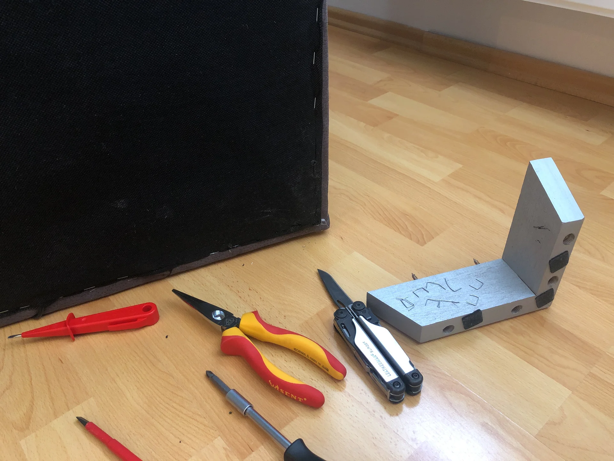
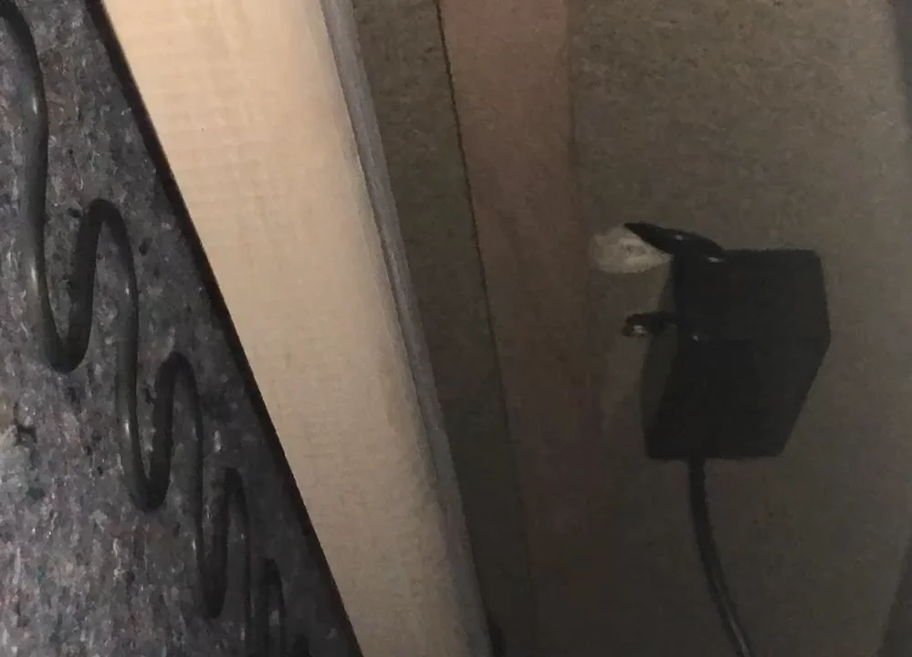
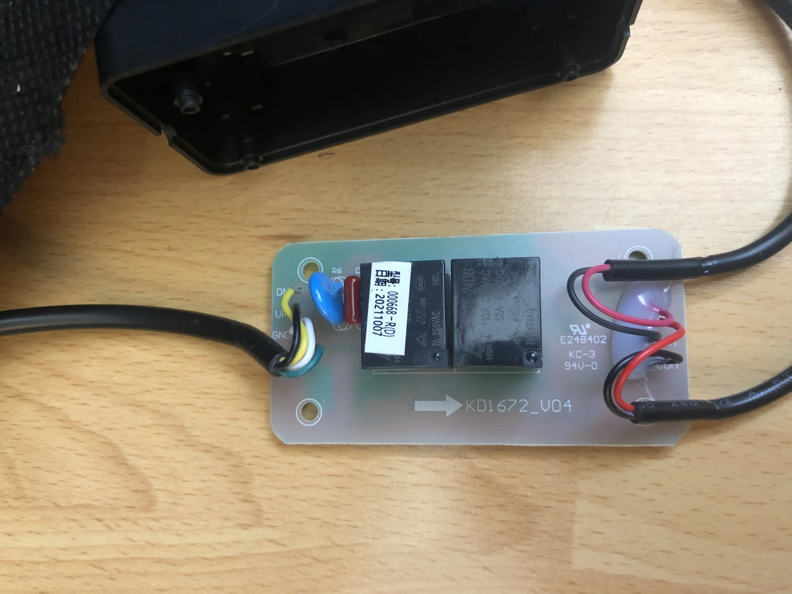
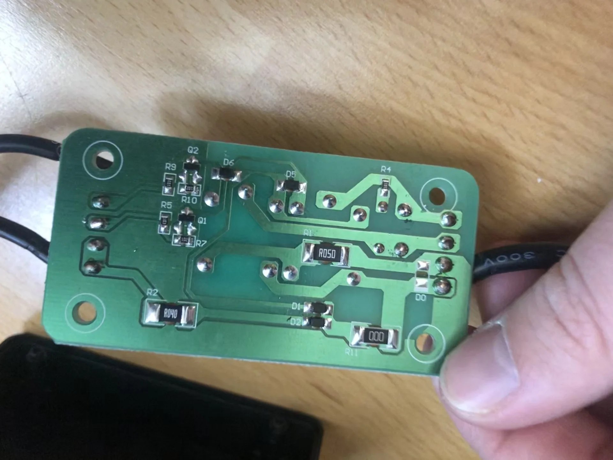
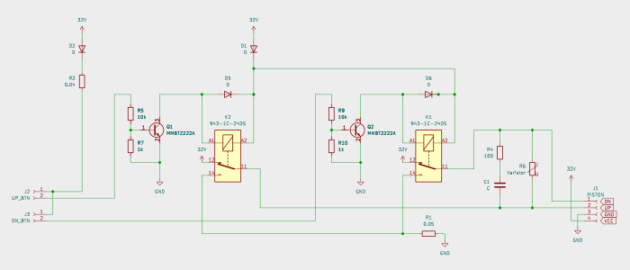
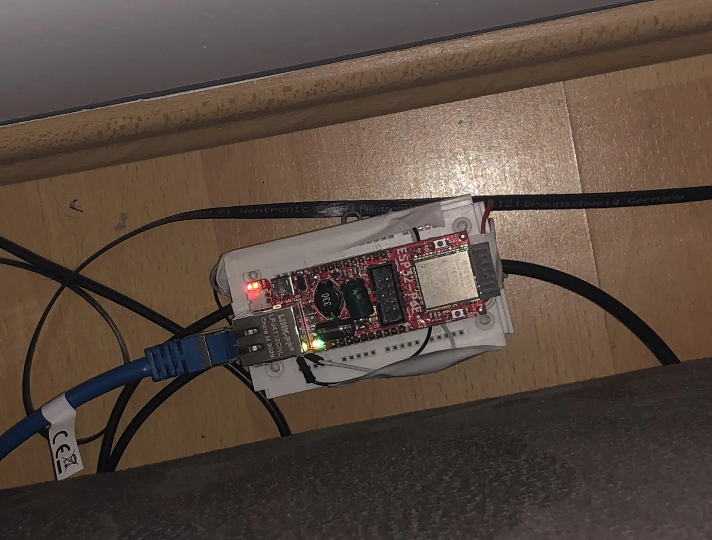

+++
title = "The Internet of Furniture"
summary = "How I reverse-engineered my electric sofa to work with Home Assistant using an ESP32. After frying a transistor and some emergency soldering, I now have a voice-controlled couch."
author = "Emanuel Mairoll"
date= "2022-05-22"
tags = ['IoT', 'Home Assistant', 'ESPHome', 'Electronics']
showTableOfContents = true
+++



Or: How I hooked up my Sofa to Home Assistant


What's better than an electrically extendable sofa? One that I can control from Home Assistant, obviously!

__*Stories from the Open Source Smart Home - Part 1*__

---

When I was shopping for furniture for my new flat, I stumbled upon the Corner Sofa *Merlin*. Did I fall in love with it because of its supreme comfort? Its elegant design? The way it perfectly complemented my living room's feng shui? 

No. I fell in love because it had two buttons that electrically extended the slim section into a full guest bed. **Two. Electric. Buttons.**


My first thought was 

> Oh, how convenient for hosting guests.

My second one was 

> I need to IoT-ify this bad boy.

Because apparently, I'm the kind of person who looks at perfectly functional furniture and thinks, "You know what this needs? An IP address."

Two days after delivery, I already had the sofa flipped on its back with my screwdriver in hand. What followed was a tale of triumph, tragedy, and the smell of burnt silicon.

---

## Act I: The Circuit



First, some reconnaissance. Getting into the internals of the sofa non-destructively was surprisingly civilized:

1. Flip sofa onto its back
2. Unscrew the right back leg to access the cover cloth directly  
3. Remove the staples holding the cover cloth in that corner
4. Stare into the darkness with a flashlight

Looking around inside reveals a very straightforward setup: an electrically extendable piston, a power supply, and a suspicious black box wiring everything together. Screwing off the box and opening it up reveals a simple circuit board.






Let's quickly go through what's happening here: The board is supplied with 32V, which passes through a 4Ω shunt to one terminal of each button. On the return path, every button goes through a 10kΩ resistor into a relay driver transistor and relay, which switch 32V and GND onto the "DN" and "UP" terminals of the piston.



So, game plan: Simply intercept the button signals and insert my own "implant" to hijack control. 

The best part? The buttons connected via a coupler, meaning theoretically no soldering required. Theoretically. (Narrator: There would be soldering.)

---

## Act II: The Implant

### Hardware Selection

For the implant, I needed something with:
- Arduino-like simplicity (because I value my sanity)
- Ethernet connectivity (because WiFi sucks for IoT)
- Enough GPIO pins for my nefarious purposes
- Good software support (see: sanity, valuing of)

After my last IoT adventure, I opted for an OLIMEX ESP32-POE again, as I was very satisfied with it. It's reliable, well-documented (as in "fully Open Source"), and has everything I needed for the project.

The only feature I wished the ESP32-POE had was built-in circuitry for handling higher voltages. Since the board lacks onboard relays or optocouplers, I decided to interface directly with the sofa's control circuits.
For the output signals, I initially tried connecting the ESP's 3.3V GPIO pins directly to the transistor bases, but the existing 10kΩ inline resistors dropped too much voltage. One quick soldering job later, I had bridged those resistors and added 820Ω resistors on the breadboard instead to properly scale the voltage. This gave the transistors exactly what they needed to switch reliably.

For the input signals, the sofa's buttons supply 32V - definitely not ESP-friendly territory. A simple voltage divider using 10kΩ and 1kΩ resistors brought those signals down to a safe 3V range that the ESP could read without releasing its magic smoke.

For power supply, I simply opted for USB because I didn't know if the piston would create ripples on the power supply that could throw the ESP off, and it was easier than messing with the sofa supply voltage or ensuring galvanic isolation for PoE.



### Software: The Path of Least Resistance

I really, REALLY didn't want to spend my evenings debugging a sofa. Can you imagine explaining that to your friends? "Sorry, can't come out tonight, my couch threw a segfault."

Meet ESPHome - Home Assistant's brilliant sibling project that turns ESP boards into smart home devices with just YAML. No C++, no Arduino IDE, just straight-forward, declarative configuration.

In ESPHome, you simply define "components" in YAML syntax. It has a huge library covering everything from physical layer (Ethernet, WiFi, OpenThread) up to application layer (MQTT, HTTP, Home Assistant). 

And while I didn't exactly *expect* to find a component for "electrically extendable sofa," there *is* a "Cover" component designed for motorized window blinds. The component provides:

- Open, close, and stop commands
- Open and close actions that can be mapped to GPIO outputs
- Timed position tracking and percentage-based reporting
- Home Assistant integration (direct mapping as HA cover)

Perfect. Here's the finished configuration:

```yaml
esphome:
  name: smart-sofa
esp32:
  board: esp32-poe
  framework:
    type: arduino
logger:
api: # Enable Home Assistant API
  password: "<API_PASSWORD>"
ota: # For Over The Air updates
  password: "<OTA_PASSWORD>"
ethernet:
  type: LAN8720
  mdc_pin: GPIO23
  mdio_pin: GPIO18
  clk_mode: GPIO17_OUT
  phy_addr: 0
  power_pin: GPIO12

cover:
  - platform: time_based
    id: sofa
    name: "Sofa"
    assumed_state: true
    open_action:
      - switch.turn_on: extend_couch
    open_duration: 9.1s
    close_action:
      - switch.turn_on: retract_couch
    close_duration: 9.1s
    stop_action:
      - switch.turn_off: extend_couch
      - switch.turn_off: retract_couch

binary_sensor:
- platform: gpio
  pin:
    number: GPIO35
    inverted: true
  id: button_open
  on_press:
    then:
      - lambda: |
          if (id(sofa).current_operation == COVER_OPERATION_IDLE && !id(sofa).is_fully_closed()) {
            id(sofa).close();
          } else {
            id(sofa).stop();              
          }
- platform: gpio
  pin:
    number: GPIO39
    inverted: true
  id: button_close
  on_press:
    then:
      - lambda: |
          if (id(sofa).current_operation == COVER_OPERATION_IDLE && !id(sofa).is_fully_open()) {
            id(sofa).open();
          } else {
            id(sofa).stop();              
          }

switch:
  - platform: gpio
    pin: GPIO32
    interlock: &interlock [extend_couch, retract_couch]
    id: extend_couch
  - platform: gpio
    pin: GPIO33
    interlock: *interlock
    id: retract_couch

```

I hooked everything together on a testing breadboard, tested it, and it worked like a charm. The sofa responded perfectly, Home Assistant detected it immediately, project basically done.

And then...

---

## Act III: The Accident

You know those safety warnings everyone ignores? "Always disconnect power before changing the wiring"? 

Yeah, obviously I didn't do that.

I had one cable carrying 32V that I'd been using to test the voltage divider. While moving things around, that cable decided to go on an adventure.

And the golden rule with transistors - never put more than 0.7V onto the base without a resistor?

Yeah, obviously my 32V cable landed directly on an unprotected transistor base.

*Silence.*

*The faint smell of silicon giving up on life.*

"Fuck."

I tested it anyway, channeling the same energy as checking if a clearly deceased parrot is just resting. The transistor was fried. Completely dead.

### The Resurrection

Now I needed to source a replacement transistor. In hindsight, I could have used pretty much any similar transistor, but at this point it was personal - I wanted the exact same one out of spite.

Fortunately, I'm still on good terms with my electronics teachers from technical high school (HTL). One phone call, a nostalgic tour through the old labs and about 2 hours later, I had my replacement transistor in hand. (Shoutout to Mr. Lindner - you're a legend!)

What followed was precision SMD soldering with a 20€ soldering iron while kneeling in front of my sofa like I was proposing to it. Somehow, through a combination of steady hands, pure determination, and what I can only assume was divine intervention, I got the tiny transistor properly soldered.

Can't show you pictures of this miraculous soldering job though, because... ehm... I lost them, or something like this.

But in any case, I then rebuilt everything properly on a smaller, fitting breadboard, connected it to the UNPLUGGED sofa (learning had occurred!), mounted it inside with double-sided tape, reassembled everything, held my breath, and powered it on.

It worked like a charm.



## The Aftermath: Living in the Future

Now my sofa is a full-fledged member of my smart home ecosystem, I can:
- Extend my sofa from anywhere in the world (because why not?)
- Set up automations ("It's 10 PM, time to become a bed!")
- Integrate with voice assistants ("Hey Siri, deploy the guest accommodations")
- Monitor sofa position in real-time (critical metrics, obviously)
- Create scenes that include sofa position ("Movie night mode: engaged")

Is this practical? Debatable. Is it necessary? Absolutely not. Is it awesome? You bet it is.

*This is Part 1 of my "Stories from the Open Source Smart Home" series. Stay tuned for more adventures in unnecessary home automation!*

*Special thanks to the ESPHome team for making amazing software, Mr. Lindner for the emergency transistor supply, and my grandma for the interior design advice that led us to this particular sofa (though I'm pretty sure "hackable electronics" wasn't on her list of criteria). No sofas were permanently harmed in the making of this project.*