+++
title = "The Internet of Roof Windows"
summary = "When your loft flat turns into a sauna every summer, the logical solution is obviously to reverse-engineer a decades-old proprietary bus protocol. A tale of digital archaeology, improvised level shifters, and ladder-based near-death experiences."
author = "Emanuel Mairoll"
date= "2023-01-07"
tags = ['IoT', 'ESPHome', 'Shelly Uni', 'Electronics', 'UART Abuse', 'Roof Windows', 'VELUX']
showTableOfContents = true
+++

__*Stories from the Open Source Smart Home - Part 2*__

---

## The Itch

Back in my Salzburg days, I lived in an absolutely wonderful loft flat. Ten minutes from the city, gorgeous views, an amazing neighborhood, and a landlord who lived below me who basically treated me as family - the kind of relationship where you'd have dinner together and chat about life. The flat itself was amazing, bright and spacious with high ceilings, and had a beautiful traditional wooden interior.

And most importantly: Electrically operated roof windows that opened directly to the starlit night sky.

There was just one thing. The day I moved in, holding that crusty remote control from 2002, I felt it. 

*The itch.*

The urge of automation, the urge of IoT-fying something that probably shouldn't be IoT-fied. 


You see, the flat did get quite warm in summer... like *seriously* warm, as loft flats do. Being able to automatically open windows based on temperature sensors or time schedules would be... useful? Sure, let's go with useful. Definitely not just an excuse to reverse-engineer a two-decade-old proprietary protocol.

Because obviously, the solution to a warm apartment isn't just opening the windows manually like a normal person. It's spending months teaching them to open themselves.

*How hard could it be?*

(Narrator: It was hard.)

## The VELUX Integra Research Rabbit Hole

My roof windows were VELUX Integra units, installed when the attic was converted around 2002. Finding ANY technical information about these specific models was like digital archaeology. VELUX's website didn't even acknowledge their existence, and customer support helpfully informed me that my model was "discontinued" and suggested I buy an entirely new window system.

Hours of googling led me through installation manuals in German, Italian, French, and what I'm pretty sure was Dutch. Each manual referenced different model numbers, different control 
systems, and absolutely none of them matched what I had (I think?).

Seriously, try to reverse engineer *anything* from a manual looking like a 1980 comic book:

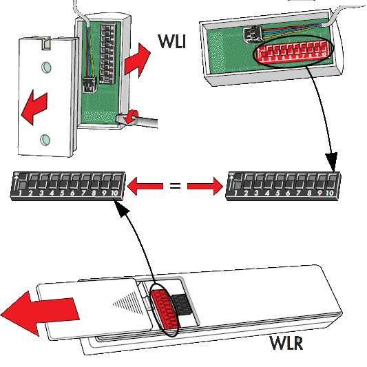

Luckily, I found one German webshop ([meurer-shop.de](https://meurer-shop.de)) that still listed vintage VELUX parts. That's when I discovered the replacement components for my system and nearly had a heart attack:

- **WCM 531** The IR control board in a small white box on my window (115€ and out of stock)
- **WLR 100** My infrared remote control (130€ and out of stock)
- **WLC 100** A mysterious "control unit" I didn't have, best described as a large box with a "bus interface" (250€ and also out of stock)
- **WLI 130** A small keypad that could be attached to the WLC (110€ and, you guessed it, out of stock)

The bottom line was:
1. Everything was crazy expensive
2. I had no clue if any of these would actually work with my very specific 2002 window variant
3. Even if I wanted to throw money at the problem, I couldn't - everything was perpetually out of stock

The WLC unit caught my attention though. The description showed a "3-wire bus for system integration." Interesting...

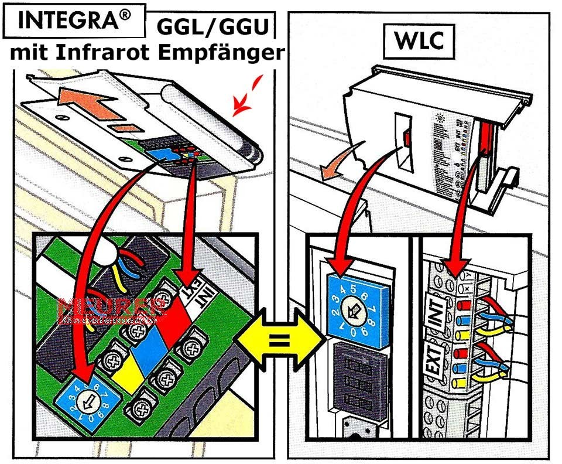

## The Parade of Failed Ideas

### The Open-Source Community

Surely someone, somewhere, made a universal remote for these windows? I scoured several electronics forums, browsed the Home Assistant community, and checked DIY electronics marketplaces like tindie.com. Althrough there were quite a few projects for the newer KLR 200 and 300, no one seemed to have tackled the ancient Integra series.

### Maybe These Overpriced Modern Products?

I spent hours researching if any of VELUX's current (overpriced) smart home products would work with my ancient window. There were adapters for their newer io-homecontrol system, but those were built for the generation after my window. If they were backwards compatible? The answer was a resounding "maybe, but probably not, but we won't tell you for sure, please buy it and find out."

Risk 300€ on a maybe? Pass.

### Power Cycling Automation

Maybe I could control it by cutting power? I opened every electrical installation box in my flat (multiple times), traced cables, flipped breakers - both to find if I'd missed any hidden control boxes somewhere, and to check if I could just cut and restore power to trigger some default behavior.

The window didn't care. It just sat there, judging me.

### The IR Remote Control

Now we're getting somewhere! I grabbed my Flipper Zero and quickly captured the IR signals of the remote. A few button presses later, I could replay them perfectly. The window obediently opened and closed at my command. Victory?

Well... not quite. IR control meant I was basically building a glorified universal remote. No feedback about whether the window was actually open or closed. No way to know if the command succeeded. Plus, IR requires line of sight - meaning I'd need the controller mounted somewhere visible, forever staring at me, silently judging my half-hearted attempt at "automation."

I even found an IR-enabled smart plug that could learn and replay signals. I could have plugged it in near the window, connected it to Home Assistant, and called it a day. 

Functional? Maybe... But where was the challenge? The complexity? The months of obsessive debugging? This felt like cheating on an exam by actually studying - technically correct but emotionally hollow.

---

### The Proprietary Wired Bus

Some of these solutions were probably technically functional but deeply unsatisfying to my engineering soul.

So I kept digging throgh [manuals](https://web.archive.org/web/20250911153605/https://www.meurer-shop.de/media/files_public/d8bf5d380b6ff5c3e3242802b04bc329/WLC%20100.pdf), and kept kept seeing references to this weird three-color bus system. Red, blue, yellow wires that could supposedly connect multiple windows together to... daisy	chain them? Open them simultaneously? Integrate them with some mysterious WLC control unit?

A proprietary bus protocol from 2002? Hidden inside my wall? Undocumented and forgotten by time?

*Ah shit, here we go again.*

## The Archaeology Begins

Remember those replacement parts? 115€ for a control board, 130€ for a remote - and all perpetually out of stock? Meaning if I messed up there would basically be no way of recovery?

So anyways, I grabbed my screwdriver and a ladder and began the ascent. The mysterious three-color bus was calling to me. But to understand it, I'd need to get intimate with the control box - which meant removing it from its home three meters up on my roof window.

Two screws held the white control box to the window frame. Simple enough, except when you're balanced on top of a ladder, trying not to think about the drop to very hard Austrian floor tiles below.  
First screw: Easy.  
Second screw... Why is it always the second screw that strips?

After some creative German vocabulary and careful persuasion with pliers, the box came free. The connector unplugged surprisingly easily - clearly designed for maintenance, unlike literally everything else about this system.

Back on solid ground, I cracked open the control box and felt like I was entering a time capsule. Through-hole components! Actual-size resistors you could read without a microscope! Chips with date codes older than me!

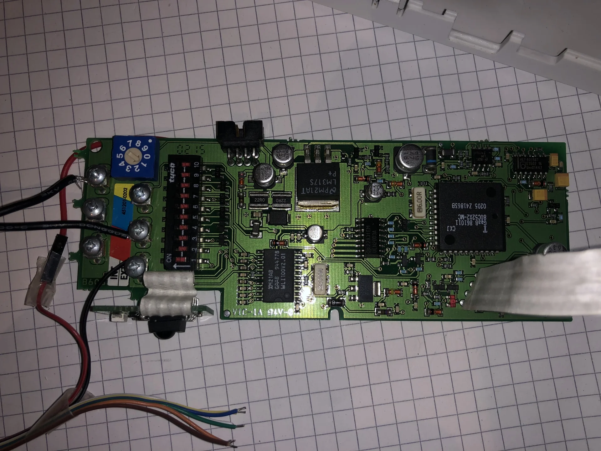

(Yes, those funny wires you see on the left weren't original - I'd already started my investigation by the time I thought to take photos. Documentation was never my strong suit.)

And there they were: six connectors, split into two groups of three. One set labeled "INT" (internal?), another labeled "EXT" (external?). The three-color bus from the manual - red, blue, and yellow - times two.

After staring at the board for probably too long, I started tracing the lines:

**The Reds:** Both red wires (INT and EXT) traced directly to ground. Easy win. At least something in this project would be straightforward.  
**The Yellows:** Both yellow wires were connected together connected through a RC filter and a diode to... ground, I think? Shielding probably?  
**The Blues:** This is where it got interesting. The blue INT directly connected to a open drain MOSFET circuit (so output probably) before connecting to a chip labeled "WLI" - hey, same label as the wall mounted keypad! The blue EXT wire went to a different PCB area and connected to a diode and RC filter, before going to an opamp chip comparing it to ground (so presumably input, to be pulled down?).

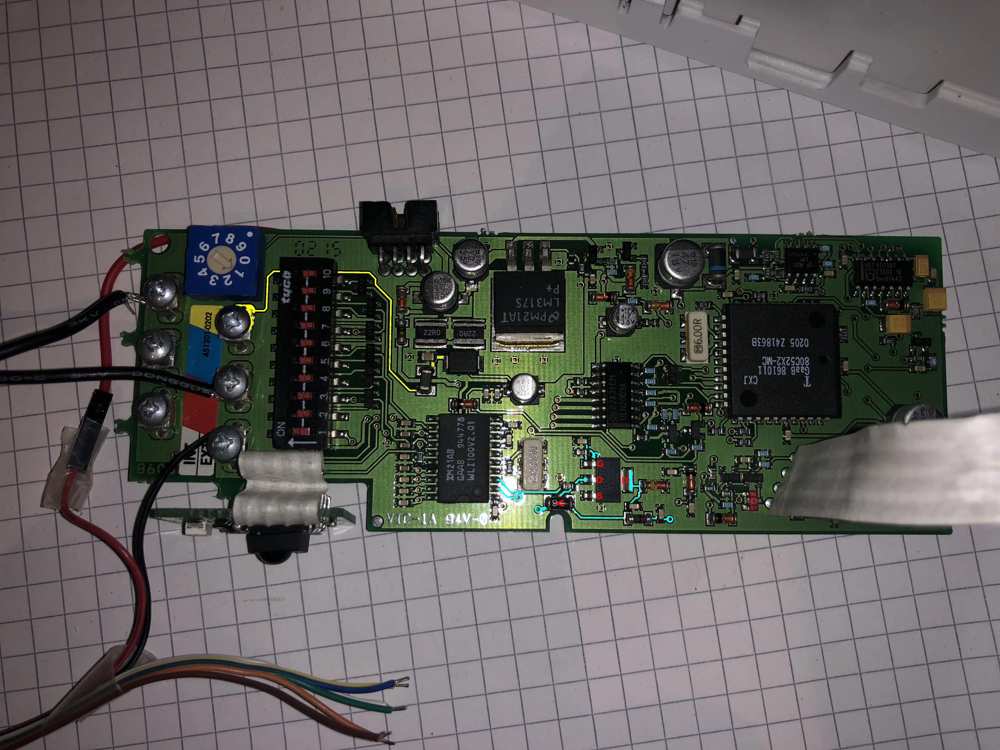
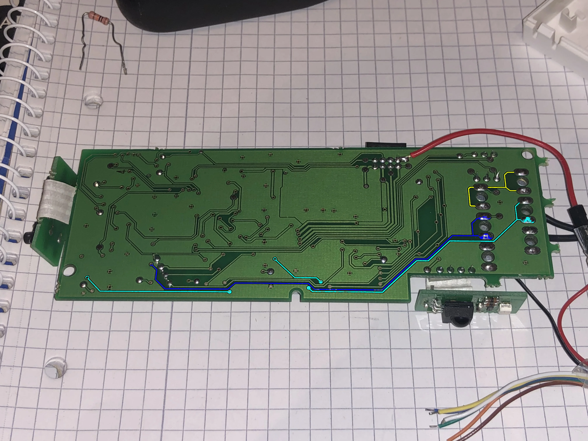
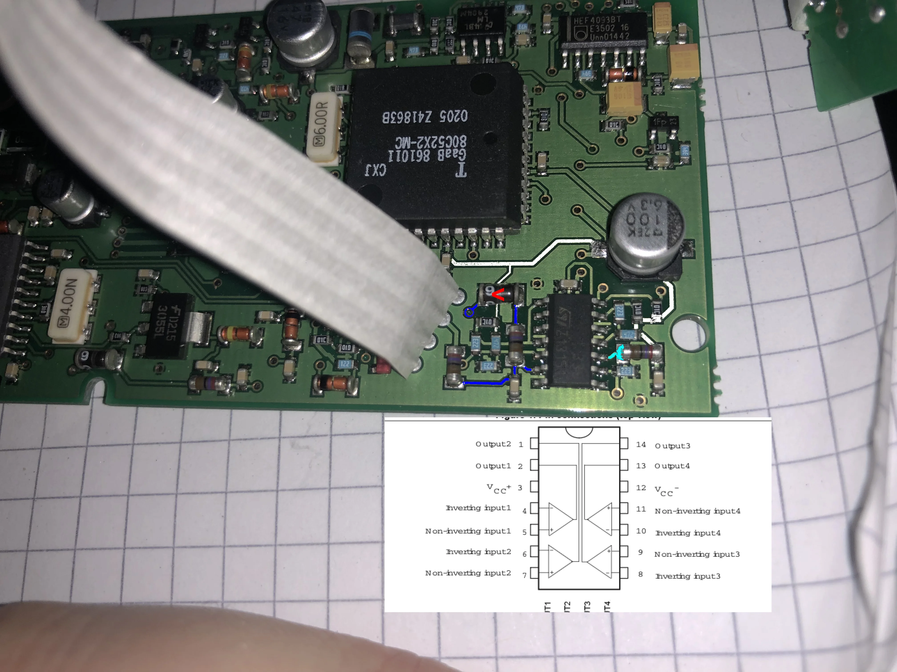

There was also another connector - the one going to the motor unit. I wasn't particularly interested in that one, but I did need to know the supply voltage. After checking the pinout, I traced the leftmost pin as it ran into an LM317S voltage regulator. That's the pin I soldered the small red cable onto that you can see in the photos above - my improvised test point for power measurements.

Armed with this knowledge, it was time for another ladder adventure. Picture me, three meters up, multimeter balanced on the top of the ladder, probes in both hands, trying to measure voltages on a live circuit while desperately not shorting anything that would kill my irreplaceable control board.

The supply voltage read 19.77V. Very particular value indeed.

And for the bus: Red connectors were indeed ground, yellow connectors seemed to be as well (supporting the shielding theory). But the blue connectors - that's where things got interesting.

The INT blue connector sat at 5.17V when idle, but when I pressed the remote - bingo - it would briefly pulse with *something* before settling back down. The EXT blue connector was being more mysterious, barely giving me any readable signal.

So there it was: A communication bus with separate internal and external connections. VELUX had built their own proprietary network protocol, hidden it inside these control boxes, and then conveniently "forgot" to document how it worked after discontinuing the product line.

## The Logic Analyzer Saga

Time to science this thing. I ordered a cheap 8-channel logic analyzer from Amazon (an AZ Delivery one - 15 euros of pure debugging power) and prepared for some signal sniffing while the thing was connected.

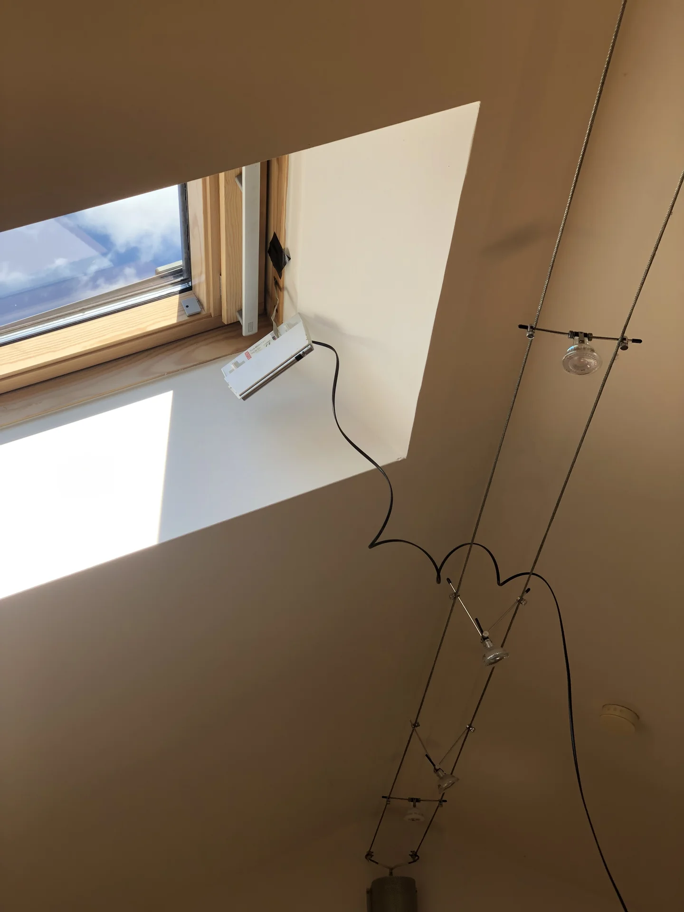
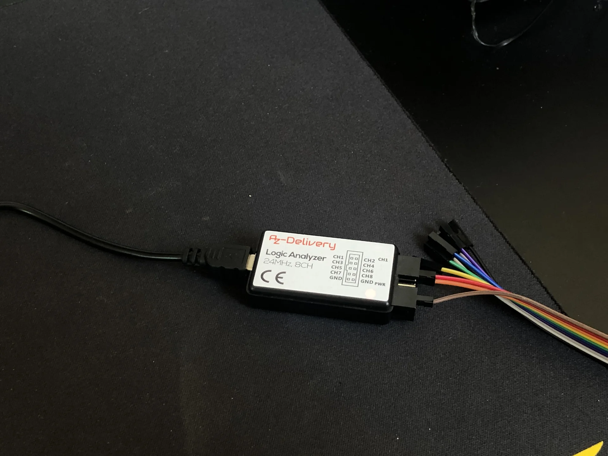


Now, connecting a 3000€ MacBook to a mains-connected roof window of indeterminate value through a 15€ funky logic analyzer required some... precautions.

So I:
1. Checked the wiring for every cable with a multimeter (twice)
2. Tested for unexpected voltage differences before connecting anything
3. Disconnected the MacBook from power (galvanic isolation, baby!)
4. Grounded myself to the common ground (static discharge prevention)
5. Prayed to the electronics gods
6. Plugged in the USB cable

First, I connected to the EXT bus. Nothing. Flatlines while the window cheerfully opened and closed. So maybe EXT *was* in fact for daisy-chaining to other windows?

So I tried the INT bus instead. 

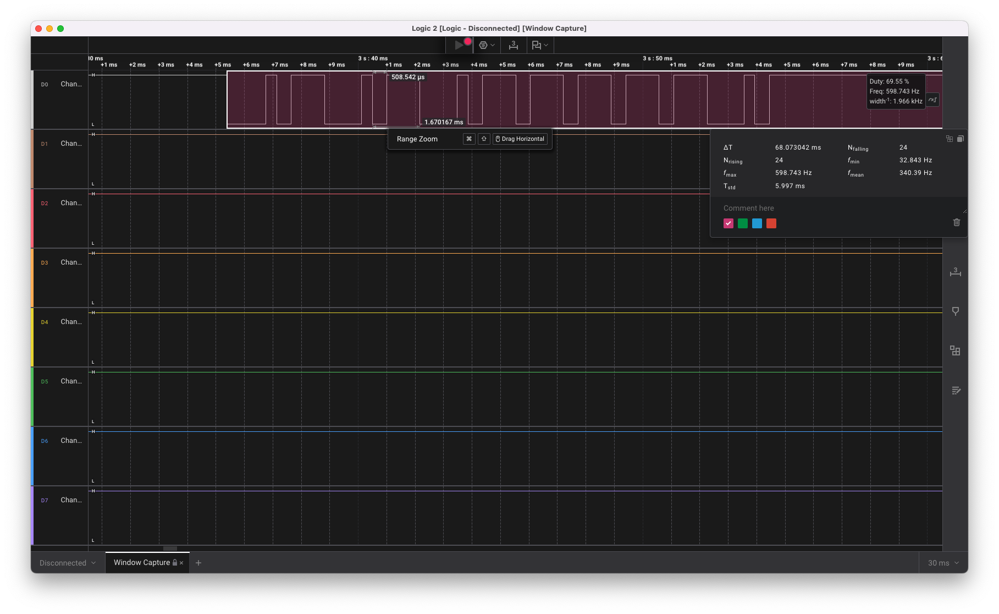

Success! When I pressed the remote, beautiful digital signals appeared. Sequences of pulses that clearly meant *something*. But what?

## The Protocol That Shall Not Be Named

The protocol wasn't I2C. It wasn't SPI. It wasn't Manchester encoding. It was... something else entirely. After clicking through every protocol decoder in my logic analyzer software, I finally looked at the raw waveform.

It was a pulse width modulated protocol. Default high, with fixed-width symbols of 1.7ms each. The low time varied between two values: 1.3ms (76% duty cycle) and 0.5ms (30% duty cycle). 

I designated 76% duty as binary 0 and 30% duty as binary 1. Then, i decoded the bit patterns by hand (yes, by hand, with a notepad like some kind of digital archaeologist).

Each command was a specific sequence repeated twice:

```
Motor 1 (window), All windows of control group:
* Open:  010101 111101  010101 111101
* Stop:  010110 011111  010110 011111
* Close: 010101 101111  010101 101111
```

Since the messages seemed stable, I figured that I didn't actually have to "understand" the protocol. There was probably addressing scheme or checksum, but I didn't care - I just needed to replicate these exact sequences.

But how do you read or even generate a duty cycle protocol with an ESP?

## The Most Cursed UART Abuse Ever

Here's where things got properly cursed.

I could have implemented proper duty cycle generation. I could have used PWM. I could have bitbanged it properly with precise timing.

Or... I could abuse UART.

Think about it: UART sends bits as high and low signals. A '1' bit is high, a '0' bit is low. If you send 0xFF, you get 8 high bits. If you send 0x00, you get 8 low bits. And if you choose your baud rate *just right*, you can make UART generate duty cycles that look like your protocol.

I started playing with the UART decoder in my logic analyzer, trying different baud rates to find one where the duty cycle patterns would consistently map to specific byte values.

At 5924 baud (a number that appears in no UART tables whatsoever) magic happened:
- The 21% duty cycle bits decoded as 0x80
- The 69% duty cycle bits decoded as 0xFC

The entire protocol could now be treated as weird UART messages. I didn't need to understand the protocol encoding, or implement a proper decoder - I just needed to send the right sequence of "wrong" UART bytes that would produce the correct duty cycle pattern.

I basically looked at my ESP's UART peripheral and said: "You're a duty cycle generator now."

## Testing the Cursed Theory

Armed with this absolutely unhinged approach, I grabbed my trusty Wemos D1 Mini and wrote the simplest possible test:

```cpp
Serial.begin(5924);
// Listen on INT bus
while(Serial.available()) {
  byte b = Serial.read();
  Serial.print(b, HEX);
}
```

Connected it to the INT bus through a level shifter (because 5.17V into 3.3V logic = magic smoke), and pressed the remote.

It worked! The ESP happily received bytes from the duty cycle protocol, thinking it was just really weird UART.



Now for the real test. I connected another wire from the ESP to the EXT bus (again through a level shifter), and tried replaying what I'd received:

```cpp
Serial.begin(5924);
// "Open" command in our cursed UART interpretation
Serial.write("\x80\xFC\x80\xFC\x80\xFC\xFC\xFC\xFC\xFC\x80\xFC");
```

I uploaded the code, held my breath, and ran it.

*The window opened.*

I stood there for a solid minute, staring at my roof window as it slowly extended, controlled by two lines of code. Months of research. Dozens of manuals in various languages. A ladder-based near-death experience.

I had successfully gaslit an ESP8266 into speaking a proprietary 2002 duty cycle protocol by abusing UART at a nonsensical baud rate. This is either genius or madness. Probably both.



## The Permanent Installation Challenge

Now for the hard part: making it permanent and invisible. The requirements were daunting:

- Must fit inside (or very close to) the control box
- ESP-based (so 3.3V internally)
- Handle the board's 19.77V supply voltage
- Interface with 5.17V bus signals
- Ideally not burn down my apartment

### Meet the Shelly Uni

After considering various ESP boards, I discovered the Shelly Uni - essentially the perfect implant for retrofitting dumb devices:

- Tiny footprint (smaller than a matchbox)
- Accepts 12-36V DC supply voltage
- Two Built-in optocouplers for potential-free outputs
- 2 GPIOs exposed for custom use, tolerant up to 24V
- ESP8266 based (hello, ESPHome!)
- Costs less than a decent pizza

The only problem? Documentation.

Now, I usually appreciate Shelly's open-source friendliness - they add reflashing headers to their devices and officially support Home Assistant integration. But the documentation for the Uni? Let's just say it was... sparse. They provided wiring examples that would work with their official firmware, sure. But a board schematic? ESP GPIO pinout mapping? Any details about what connects to what internally? Nope.

Thankfully, the Tasmota community (ESPHome's "competitor" in the custom firmware space) had already done the hard work. They'd reverse-engineered the entire pinout through careful probing and documented everything. GPIO4 and GPI15 for the optocouplers, GPIO17 for ADC input, GPIO0 for the onboard LED - all meticulously mapped out.

After acquiring a programming adapter for the 1.27mm pitch headers (they had to keep it compact somehow), I could finally flash ESPHome onto it using the Tasmota-documented pinout.

*Funny sidenote: Did you know you can use a Wemos D1 mini as UART adapter? I somehow managed to fry my dedicated USB-to-serial adapter, so I improvised by wiring another Wemos' RX/TX pins to the Shelly's programming header. You just need to tape down the reset button on the Wemos, and it works perfectly. Though I wouldn't recommend it as a long-term solution.*

### The Cursed Electronics

I needed to:

**For writing to the bus (ESP to Window):** The Shelly's optocouplers were perfect. I could just use them to pull down the INT to ground as needed. Simple, safe, and effective.

**For reading from the bus (Window to ESP):** This is where things got... creative. 

I somehow needed to step down the 5.17V signal to 3.3V for the ESP's GPIO. Technically, the board GPIO pins can tolerate up to 24V, but as said - there is no documentation on *how* thats done. I tried to trace the internal circuitry, but the PCB was so tiny and densely packed that I couldn't be sure.

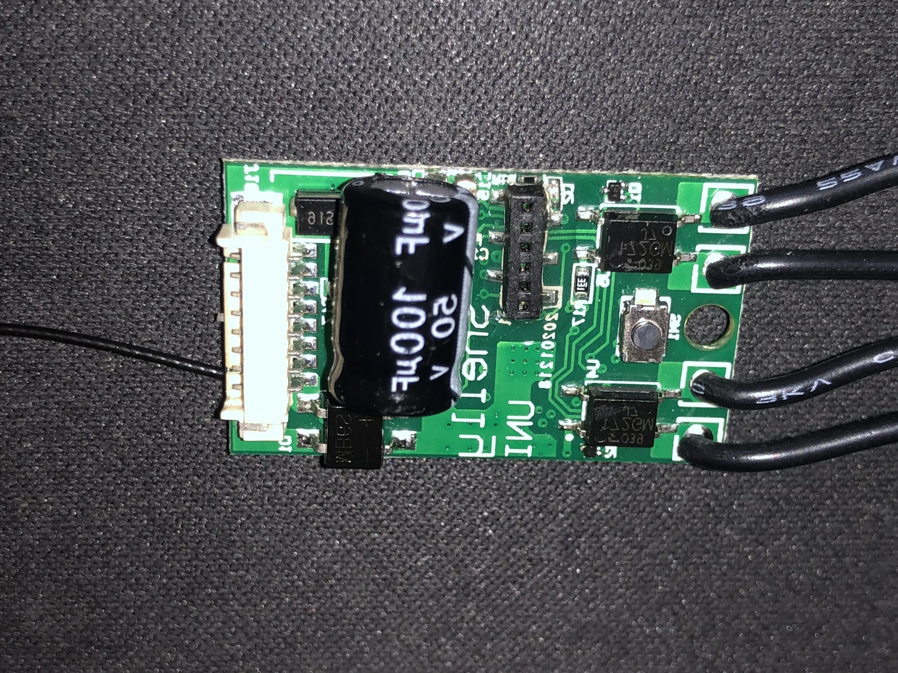
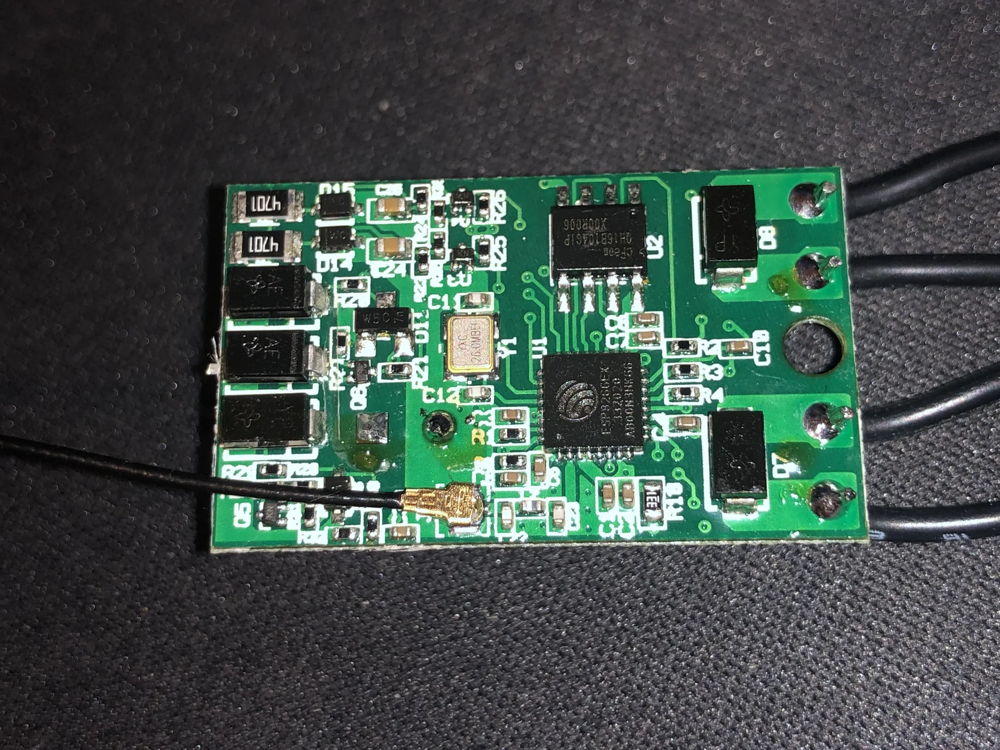

Remember, if I somehow managed to connect anything higher than the 5.17V to the EXT bus (something something pullup resistor to supply voltage), I could potentially damage the entire window control board. Not an option.

So instead I decided to play it safe and use my own level shifting solution, while somehow keeping it tiny enough to fit inside the cramped control box.

Question: What is the simplest, smallest, cheapest level shifter you can think of?

A small TTL chip? *Easier*

A voltage divider with two resistors? *Easier*

My solution? A single inline Zener diode.

That's right. I used a 1.7V Zener diode as the world's jankiest level shifter. The 5.17V signal from the board hits the diode, gets shifted to 3.3V, feeds directly into the ESP's GPIO. One component. Maximum curse. Minimum dignity.

### The Cursed Test Setup

Before committing to the permanent installation, I had to test the entire setup on my desk. So I had *another* D1 mini to simulate the window bus, sending the same UART commands I had recorded earlier.

The setup was ridiculous:
- The D1 mini sending commands through a proper level shifter (up to 5V)
- Those signals going through my cursed Zener "level shifter" (back to 3.3V)
- Into the Shelly Uni ESP running ESPHome
- It answering back through its optocoupler (pulling the INT bus low)
- Into the D1 Mini for verification
- While another D1 Mini served as serial bridge for debugging output of the Shelly

Yes, I was using two ESPs to test another ESP. Yes, this was probably the most over-instrumented roof window in Austria. No, I have no regrets.

This is at least cleaned up a little bit, after I acquired another USB-to-serial adapter to replace my fried one:

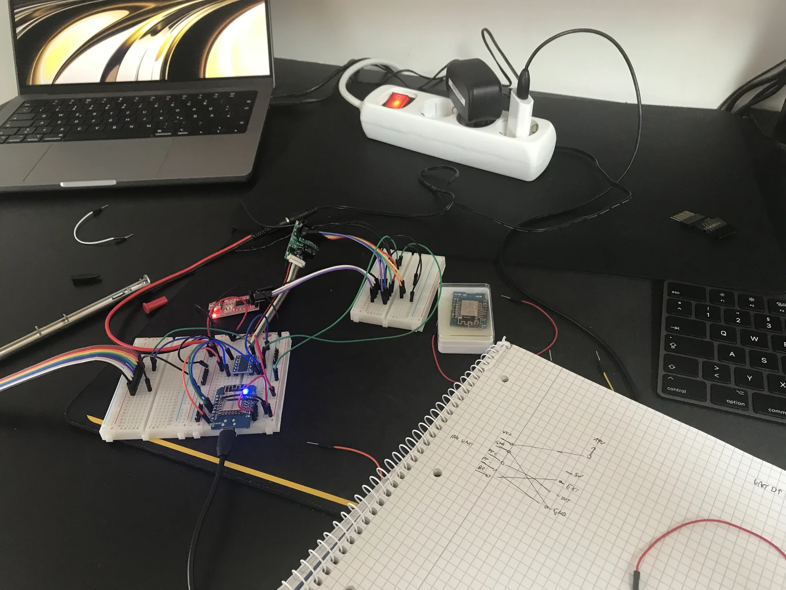

Miraculously, nothing released the magic smoke. The Zener diode, despite being the electronic equivalent of using a hammer as a screwdriver, worked perfectly.

## Installation Day

After weeks of testing on my desk with increasingly long cables snaking through my flat (at one point I had a 5-meter USB cable running from my desk to the window for "convenience"), it was time for the final installation.

The beauty of all my preparation was that the actual installation would be surprisingly straightforward. No soldering iron balanced on a ladder, no hair-thin wires to attach while three meters up. Everything was pre-wired, pre-configured, and ready to go.

First things first: power off at the breaker. Learning had occurred.

Back up the ladder one last time, I opened the control box and surveyed my target. The Shelly Uni, already flashed with my ESPHome config, had all its connections ready:
- Power supply wire to my pre-soldered red test point (19.77V)
- Ground to one of the red ground connectors
- Optocoupler output (GPIO15) between ground and the EXT blue connector (for sending commands)
- The cursed Zener diode (already soldered inline with the Shelly's GPIO05 blue wire) to the INT blue connector (for receiving commands)

I connected everything methodically, double-checked each connection, triple-checked I hadn't created any shorts, then climbed back down and walked to the breaker box.

The moment of truth. I flipped the breaker.

**First observation:** No magic smoke. Always a good start.

**Second observation:** The Shelly's LED was blinking happily, broadcasting its "I'm alive!" signal.

**Third observation:** Home Assistant immediately detected it and showed the roof window entity as available.

I walked back to the laptop with the Home Assistant dashboard, and pressed the "Open" button.

*The window opened.*

Three months of work, and it just... worked. First try. No debugging. No troubleshooting. I was almost disappointed by the lack of drama.



The final touch was making it look professional. The Shelly *almost* fit into the remaining empty space in the control box. After removing the box's sliding cover, the Shelly nestled perfectly into the available space. A bit of Gaffer Tape to act as new cover, and it almost looked like it belonged there. 


## The Configuration

The final ESPHome configuration ended up just a little bit messier than my initial test (due to the message mapping), but still surprisingly simple:

```yaml
esphome:
  name: roof-window-office
esp8266:
  board: esp01_1m
logger:
  level: DEBUG
ota:
  password: <OTA_PASSWORD>
api:
  password: <API_PASSWORD>
wifi:
  ssid:  <WIFI_PASSWORD>
  password:  <WIFI_PASSWORD>
  fast_connect: true

globals:
  - id: skip_once # to account for the echoing of the messages on the bus
    type: bool
    restore_value: false

uart:
  id: data_bus
  tx_pin:
    number: GPIO15 # optocoupler
    inverted: true
  rx_pin:  
    number: GPIO5 # zener
    mode:
      input: true
      pullup: true
  baud_rate: 5924 # so cursed
  debug:
    direction: BOTH
    dummy_receiver: true
    after:
      timeout: 100ms
    sequence:
      - lambda: |
          UARTDebug::log_hex(direction, bytes, '-');

          if (direction != UART_DIRECTION_RX) { // dont forget this, you will get an infinite loop otherwise
            return;
          }

          int32_t message = 0;
          if (bytes.size() != 24) return;
          for (int i=0; i<24; i++){
            if (bytes[i] > 0xB0) {
              message = (message << 1) + 1;
            } else {
              message = (message << 1);
            }
          }

          switch(message){
            case 0b010101111101010101111101: //M1 Open All
            case 0b010101111101000011111110: //M1 Open 1
            {
              id(skip_once) = true;

              auto call = id(window).make_call();
              call.set_command_open();
              call.perform();

              break;
            }
            case 0b010101101111010101101111: //M1 Close All
            case 0b010101101111000011111110: //M1 Close 1
            { //M1 Close All
              id(skip_once) = true;

              auto call = id(window).make_call();
              call.set_command_close();
              call.perform();

              break;
            }
            case 0b010110011111010110011111: //M1 Stop All
            case 0b010110011111000011111110: //M1 Stop 1
            {
              id(skip_once) = true;

              auto call = id(window).make_call();
              call.set_command_stop();
              call.perform();

              break;
            }
          }

cover:
  - platform: time_based
    id: window
    device_class: window
    name: "Roof Window"
    assumed_state: true
    has_built_in_endstop: true
    open_duration: 31s
    open_action:
      then:
        - lambda: |-
            if (id(skip_once)) {
              id(skip_once) = false;
              return;
            }

            //                   010101                              111101                              010101                              111101
            static uint8_t msg[]{0x80, 0xFC, 0x80, 0xFC, 0x80, 0xFC, 0xFC, 0xFC, 0xFC, 0xFC, 0x80, 0xFC, 0x80, 0xFC, 0x80, 0xFC, 0x80, 0xFC, 0xFC, 0xFC, 0xFC, 0xFC, 0x80, 0xFC};
            id(data_bus).write_array(msg, sizeof(msg));
    close_duration: 31s
    close_action:
      then:
        - lambda: |-
            if (id(skip_once)) {
              id(skip_once) = false;
              return;
            }

            //                   010101                              101111                              010101                              101111
            static uint8_t msg[]{0x80, 0xFC, 0x80, 0xFC, 0x80, 0xFC, 0xFC, 0x80, 0xFC, 0xFC, 0xFC, 0xFC, 0x80, 0xFC, 0x80, 0xFC, 0x80, 0xFC, 0xFC, 0x80, 0xFC, 0xFC, 0xFC, 0xFC};
            id(data_bus).write_array(msg, sizeof(msg));
    stop_action:
      then:
        - lambda: |-
            if (id(skip_once)) {
              id(skip_once) = false;
              return;
            }

            //                   010110                              011111                              010110                              011111
            static uint8_t msg[]{0x80, 0xFC, 0x80, 0xFC, 0xFC, 0x80, 0x80, 0xFC, 0xFC, 0xFC, 0xFC, 0xFC, 0x80, 0xFC, 0x80, 0xFC, 0xFC, 0x80, 0x80, 0xFC, 0xFC, 0xFC, 0xFC, 0xFC};
            id(data_bus).write_array(msg, sizeof(msg));


```

## The Verdict

**Investment:**
- Shelly Uni: 12€
- Logic analyzer: 12€
- Replacement Serial Adapter: 7€
- Various components and cables: 20€
- 1.27mm pitch adapter: 8€
- Time invested: An unspecified amount of evenings
- Ladder-related near-death experiences: 4
- Professional dignity lost: All of it

Was the time invested worth it? Absolutely not.  
Would I do it again? Already planning the next stupid automation.

Because there's something magical about sitting at your desk on a hot summer night, looking up through your roof window at the stars, and knowing that you can close it with a voice command. Even more if that voice command triggers a Home Assistant automation that sends an API call to an ESPHome device that pretends to be a UART device at 5924 baud, sending commands into a proprietary bus through an optocoupler and reading responses through a Zener diode from a circuit board that was probably designed before I was born.

---

*This is Part 2 of my "Stories from the Open Source Smart Home" series. No warranties were voided, no windows were bricked (miraculously), and my landlord - who I'm still close with - found the whole thing pretty funny when I showed it to her. The system was carefully removed when I moved out, leaving no trace except for one tiny extra VCC wire that nobody will ever notice.*


