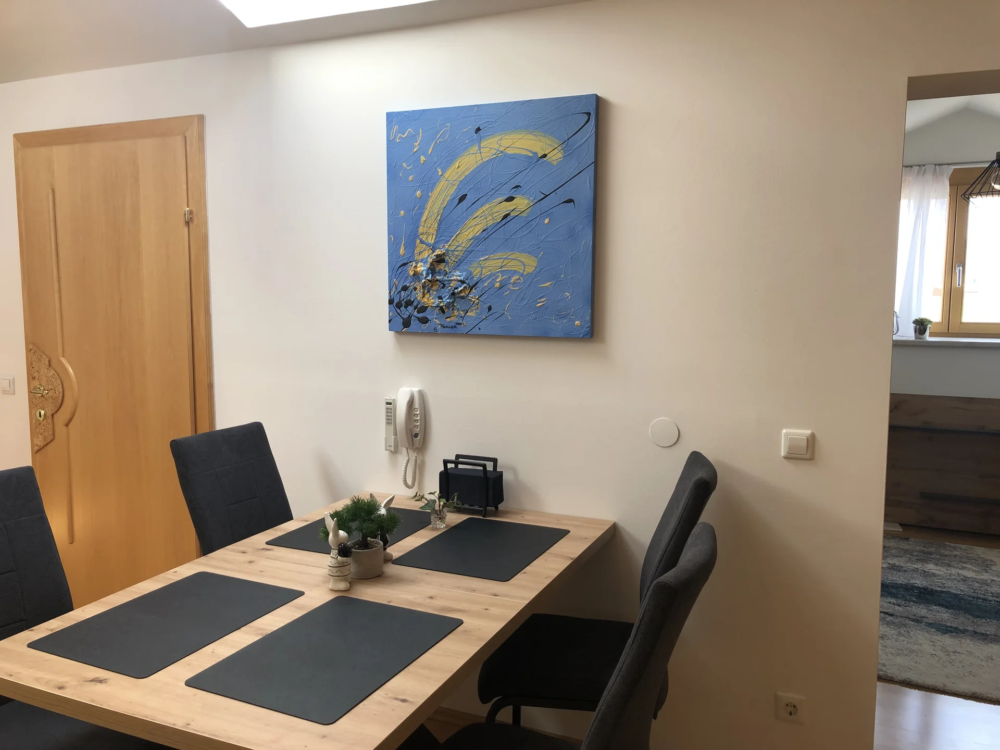
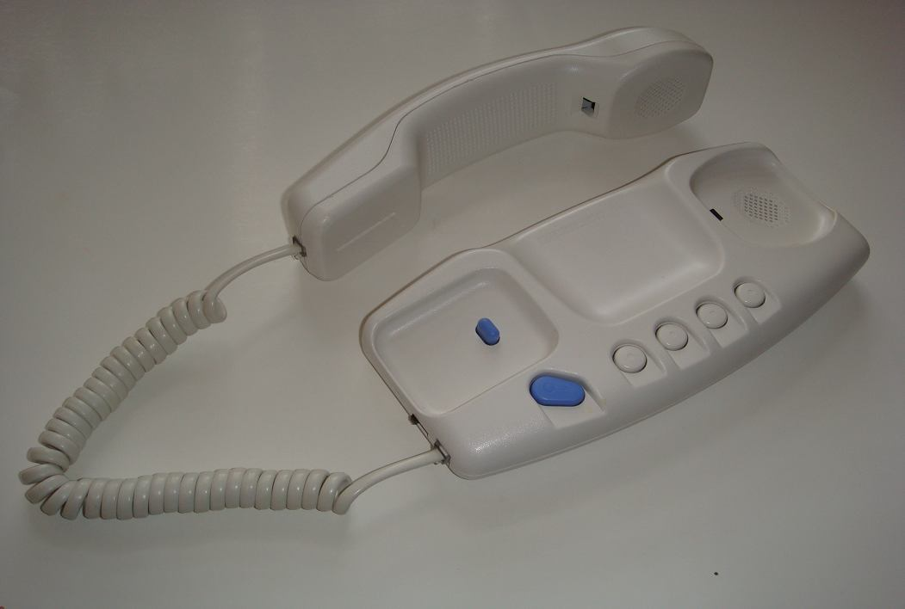
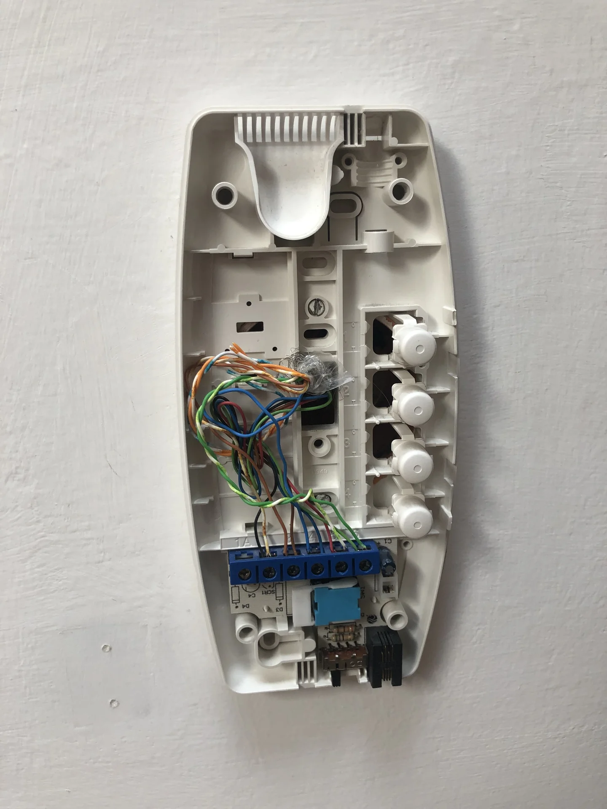
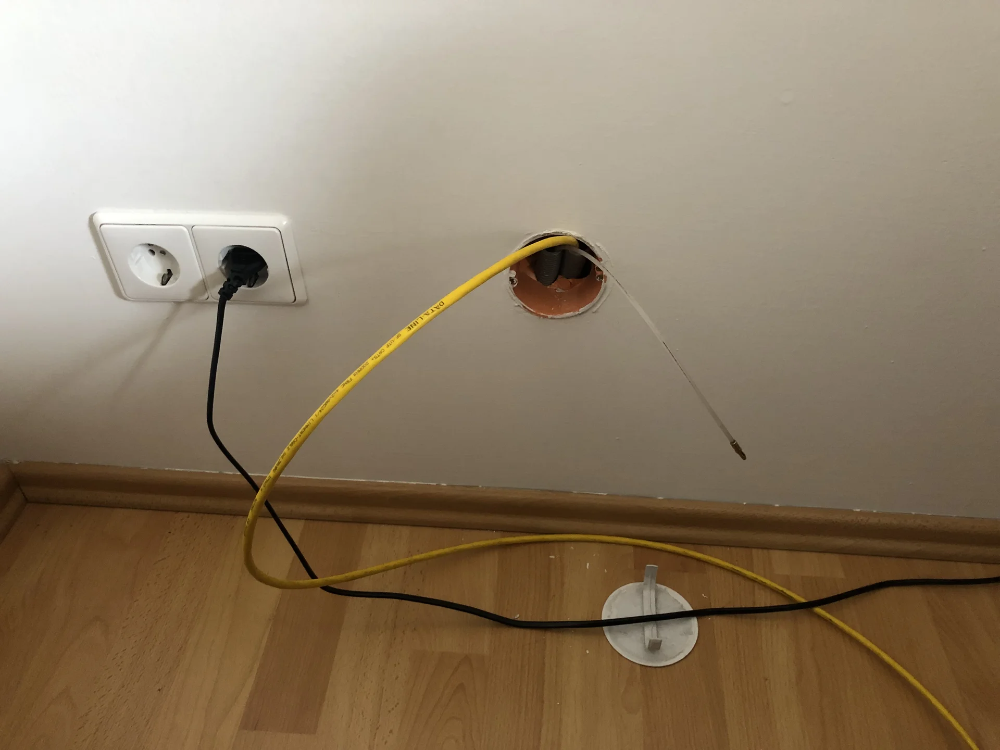
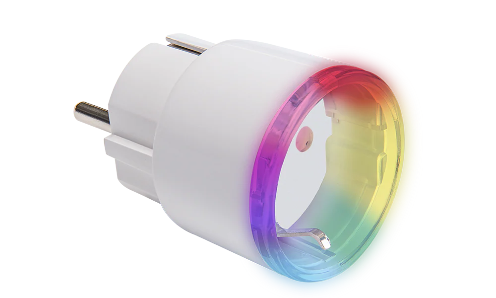

+++
title = "The Internet of Entrance Doors"
summary = "How I taught my apartment's entrance door to recognize me and open automatically. A surprisingly practical tale of BLE authentication, hidden ESPs, and the occasional accidental door opening while driving by."
author = "Emanuel Mairoll"
date = "2023-08-12"
tags = ['IoT', 'Home Assistant', 'ESPHome', 'BLE', 'iOS Shortcuts', 'Door Automation']
showTableOfContents = true
+++


Or: How I achieved the ultimate lazy person's dream - never fumbling for keys again


Compared to my previous adventures in this series - reverse-engineering a proprietary sofa protocol and decoding decades-old roof window communications - this project was refreshingly straightforward. No ladder acrobatics, no fried transistors, no proprietary bus protocols from the early 2000s.

Just a simple goal: Make my entrance door open automatically when I approach it. You know, like in Star Trek, but for a 1970s Austrian apartment building.

__*Stories from the Open Source Smart Home - Part 3*__

---

## The Problem: Keys Are So Last Century

My Salzburg flat came with a modern keypad system for the building's entrance door. Great in theory - no keys to lose, just remember a code. Future.

Until you try punching in a 6-digit code while balancing groceries, in the rain. And heaven forbid you get one digit wrong and have to start over while your frozen foods slowly defrost. Future, this was not.

But: The intercom handset system in my flat had a button to buzz people in. Every time I approached the building, loaded down with shopping bags, I'd think: "If only I could press that button from outside." Then I'd think: "Wait, I literally automate things for fun."

The itch was back.



## The Plan: A Three-Part System

The system would need three parts:
1. **Door Opener**: Something to physically press the intercom button
2. **Key Detector**: A sensor near the entrance to detect my approach
3. **Key App**: Something on my phone to authenticate that it's actually me

Simple enough. What could possibly go wrong?

(Spoiler: I accidentally opened my door while driving past my building. We'll get to that.)

## Act I: The Intercom Surgery

First step: Figure out how to electronically "press" the intercom button. While I could have gone the crude route with a SwitchBot or similar mechanical button pusher, where's the elegance in that? Plus, I have this weird compulsion to open up every electronic device I own.


Image source: [This Manual](https://interfoni.rs/wp-content/uploads/2019/08/Bticino-334202-stari-stil-5-zica-interfonska-slusalica-sema-prikljucaka.pdf)

### The Reconnaissance

The intercom was a BTICINO BTI334202 SPRINT - a fairly standard unit with four buttons for various functions (which I never quite figured out or used), plus one satisfying blue button for opening the door. Two screws and three plastic clips later I was looking at a surprisingly simple setup. A 5-wire bus system connected everything, and shorting the right two wires would trigger the door.

Perfect. All I needed to do was short these two contacts, and the door would open.




One convenient feature of this system are the screw terminals - no soldering required. I just loosened the terminals, added two additional wires from an ethernet cable I had laying around, and tightened them back down. Simple, clean, and (importantly) reversible.

### The Clean Installation

For tidiness (and probably some deep-seated need to make everything look professional), I decided to run the wires through the wall. Lucky for me, the intercom already had cables feeding into the wall cavity, and there was an existing cable duct that ran directly behind where my couch would sit. Even better - that duct was still empty, so pulling the cable through it was a breeze with my pulling rod. Sometimes the automation gods smile upon you.



On the other side, behind the couch, I connected the ethernet wires to an ESP32-GATEWAY board with a simple relay module. When the relay closes, it shorts the wires, "pressing" the button. The ESPHome configuration couldn't be simpler:

```yaml
esphome:
  name: intercom
esp32:
  board: esp32-gateway
  framework:
    type: arduino
logger:
api:
  password: <API_PASSWORD>
ota:
  password: <OTA_PASSWORD>
ethernet:
  type: LAN8720
  mdc_pin: GPIO23
  mdio_pin: GPIO18
  clk_mode: GPIO0_IN
  phy_addr: 0

switch:
  - platform: gpio
    pin: GPIO32
    name: "Door Opener"
    id: door_opener
    on_turn_on:
      then:
        - delay: 0.2s
        - switch.turn_off: door_opener

binary_sensor:
  - platform: gpio
    pin:
      number: GPIO34
      inverted: true
    id: button_onboard
    on_press:
      then:
        - switch.turn_on: door_opener
```

The 0.2-second delay mimics a human button press - long enough to register, short enough not to annoy the door mechanism.

ESPHome automatically integrated with Home Assistant, which then exposed it through Homebridge to HomeKit. Within minutes, I could open my entrance door with Siri. 

"Hey Siri, open the door." 
*Bzzzzt.* 
Magic.

## Act II: The Authentication Dilemma

Now, having a button on my phone to open the door is nice, but the dream was hands-free operation. The door should just *know* it's me approaching and open automatically. So, how to detect me?

### The Failed Approaches

**Attempt #1: WiFi Detection**
iOS Shortcuts can trigger when connecting to specific WiFi networks. It sounds perfect in theory: Trigger the door opener when my phone connects to my home WiFi. 
However, the Problems with this became immediately apparent:
- The WiFi sometimes reaches the surrounding area (hello, random door openings)
- The WiFi sometimes doesn't reach the entrance (hello, waiting in the rain)
- The Latency between connecting and the shortcut running is unpredictable in general

**Attempt #2: Geolocation**
iOS also supports location-based automations. So: Set up a geofence around my building, trigger when entering. What could go wrong?

Well, it turns out GPS resolution is sometimes... optimistic. One time when I drove past my building on the way to somewhere my grandparents, the automation triggered. Twenty minutes later, I realized my building's door had been wide open the entire time. Well, that was a fun drive back.

Geofencing: Not precise enough for entrance doors, apparently.

### The Breakthrough: BLE Authentication

What I needed was something with:
- Short range (5-10 meters maximum)
- Fast detection
- Secure enough that neighbors couldn't accidentally trigger it
- Works in iOS background mode (the killer requirement)

Enter Bluetooth Low Energy (BLE). It turns out iOS has surprisingly good support for BLE in shortcuts - originally designed for medical devices and fitness trackers, but perfectly suited for proximity-based authentication as well.

The concept was straightforward: place a BLE beacon near the door that broadcasts a challenge, have my phone respond with the correct response, door opens. Like a cryptographic handshake, but for doors.

## Act III: The BLE Key System

### The Protocol

I designed a simple HMAC-based authentication system:

1. **The ESP32 beacon** continuously advertises a BLE service with a "challenge" characteristic
2. **The challenge** is a hash of the current time (rounded to 1-second intervals) plus a salt
3. **The phone** reads this challenge, computes HMAC-SHA256(challenge + shared_secret)
4. **The phone** writes this response back to a "response" characteristic
5. **The ESP32** validates the response and triggers the door if correct

### The Sensor Hardware

For the BLE beacon, I needed something that could run ESPHome, support Bluetooth operations, and sit inconspicuously in the building entrance without looking like a surveillance device.

The Shelly Plug Plus S turned out to be the perfect candidate for this. It's one of those smart plugs that Shelly makes for home automation, but what makes it special for hackers is that Shelly deliberately makes their devices reflashable. They add programming headers, don't lock down the bootloader, and even document the pinouts. It's like they *want* us to hack their products (and honestly, that's why I keep buying them). The Plus S model uses an ESP32, giving plenty of power for BLE operations while still fitting in a compact plug form factor that wouldn't raise eyebrows in the building entrance.


Image source: [Shelly Online Store](https://www.shelly.com/products/shelly-plus-plug-s-white?variant=56273485365597)

After cracking it open and finding the clearly labeled programming headers, flashing it with custom firmware was a breeze. Five minutes later, I had a fully functional smart plug running ESPHome.

### The Software

The ESPHome configuration is surprisingly simple - Most of the complexity is hidden in the `esp32_ble_key` section. It's a custom C++ component that implements the time-based challenge-response authentication.

```yaml
esphome:
  name: bouncer
  platform: ESP32
logger:
api:
  password: <API_PASSWORD>
wifi:
  ssid: <WIFI_SSID>
  password: <WIFI_PASSWORD>
  fast_connect: true

time:
  - platform: homeassistant
    id: homeassistant_time

external_components:
  - source: my_components

esp32_ble_key:
  authorizer: key_detected
  time_source: homeassistant_time
  secret: <SHARED_SECRET>

binary_sensor:
  - platform: template
    name: "Key Detected"
    id: key_detected
    device_class: presence
    filters:
      - delayed_off: 20s
```

Conveniently, the Shelly Plug barely reached my home WiFi from the entrance. Being permanently installed there made the connection reliable enough to consistently report back to Home Assistant.

Not shown here is the additional logic to keep the smart plug working as a power outlet, which is trivial in ESPHome and a nice bonus feature. We don't want to lose that functionality ;)

#### The `esp32_ble_key` Custom Component

ESPHome has a neat feature where you can write your own components in C++ when the built-in ones don't cut it. These live in a `my_components` folder and extend ESPHome's functionality with whatever crazy protocol or hardware you need to support. Think of them as plugins that integrate seamlessly with the YAML configuration - you get all the benefits of ESPHome (OTA updates, Home Assistant integration, logging) while having the full power (and complexity) of C++.

Every second, the component generates a new challenge by hashing the current timestamp with a salt, then broadcasts this via a BLE characteristic. When a phone connects and reads the challenge, it calculates SHA256(challenge + shared_secret) and writes the response back. The ESP validates this response and triggers the door:

```cpp
void ESP32BLEKeyComponent::process_incoming_data_(
  const std::vector<uint8_t> &data
) {
  // Calculate expected: SHA256(challenge + secret)
  std::string challenge_plus_secret = 
    format_hex(this->challenge_) + this->secret_;
  SHA256 sha;
  sha.update(challenge_plus_secret);
  auto expected_hash = sha.digest();
  
  if (data == expected_hash_vec) {
    // Valid response - trigger door opener!
    this->authorizer_->publish_state(true);
    this->authorizer_->publish_state(false);
    return;
  }
  
  // Also check previous challenge for time drift...
}
```

The challenge rotates every second, so intercepted responses become useless almost immediately. The component also accepts the previous challenge (up to 3 seconds old) to handle processing delay.

#### Security Considerations

If you are familiar with secure ranging, you might suspect this isn't bulletproof. And you'd be right.

The obvious vulnerability here is a relay attack. Someone could intercept the BLE challenge-response authentication, relay it to an accomplice near my phone, get the valid response, and relay it back to open the door. The timeout window doesn't help much when radio waves move at the speed of light.

For truly secure authentication, you'd need UWB (Ultra-Wideband) secure ranging that measures time-of-flight - basically using physics to prove the phone is actually there, not being relayed. Many vendors do this with their car keys, measuring the exact nanoseconds it takes for radio waves to bounce back, which can't be faked or relayed, at least if you obey the laws of special relativity. It's elegant, secure - and completely overkill for my use case.

Let's be real here. This is rural Austria. My neighbors literally keep their doors unlocked. The elderly couple next door hasn't locked their door since 1987. Someone sophisticated enough to perform a BLE relay attack would probably just... follow another resident in. The threat model isn't sophisticated attackers - it's "I don't want to fish for keys while carrying groceries."

Safe enough.

### The iOS App

The most constrained part of the whole system was iOS. Background Bluetooth in iOS Shortcuts is... quirky. You get 30 seconds of runtime maximum, no UI, limited API access, and if you do anything Apple doesn't like, your shortcut silently fails.

I first tried to create it as embedded script in one of the many JavaScript for Automation apps (Scriptable, etc). But these apps have their own quirks, and getting BLE to work reliably was a nightmare. After several failed attempts, I settled on using a custom iOS App with a embedded Shortcut that implements authentication logic.

When triggered, the shortcut:
1. Scans for BLE devices with the specific service UUID
2. Connects to the first one found
3. Reads the challenge characteristic
4. Computes the response
5. Writes it back
6. Disconnects 
7. Returns success/failure

In Swift, the core BLE logic looks like this:
```swift
class BLEClient: NSObject, CBCentralManagerDelegate, CBPeripheralDelegate, @unchecked Sendable {
    
    let targetServiceUUID = CBUUID(string: "<SERVICE-UUID>")
    let readCharacteristicUUID = CBUUID(string: "<REQUEST-UUID>")
    let writeCharacteristicUUID = CBUUID(string: "<RESPONSE-UUID>")

    var secret: String = <INJECTED-VIA-SHORTCUT>
    var targetPeripheral: CBPeripheral?

    ...

    @MainActor func scanForPeripherals() {
        if centralManager.state == .poweredOn {
            centralManager.scanForPeripherals(withServices: [targetServiceUUID], options: nil)
        ...
    }

    func centralManager(_ central: CBCentralManager, didDiscover peripheral: CBPeripheral, advertisementData: [String : Any], rssi RSSI: NSNumber) {
        Task { @MainActor in
            targetPeripheral = peripheral
            centralManager.stopScan()
            centralManager.connect(peripheral, options: nil)
        }
    }

    func centralManager(_ central: CBCentralManager, didConnect peripheral: CBPeripheral) {
        peripheral.delegate = self
        peripheral.discoverServices([targetServiceUUID])
    }

    func peripheral(_ peripheral: CBPeripheral, didDiscoverServices error: Error?) {
        guard let services = peripheral.services else { return }
        for service in services where service.uuid == targetServiceUUID {
            peripheral.discoverCharacteristics([readCharacteristicUUID, writeCharacteristicUUID], for: service)
        }
    }

    func peripheral(_ peripheral: CBPeripheral, didDiscoverCharacteristicsFor service: CBService, error: Error?) {
        guard let characteristics = service.characteristics else { return }
        for characteristic in characteristics {
            if characteristic.uuid == readCharacteristicUUID {
                peripheral.readValue(for: characteristic)
            }
        }
    }

    func peripheral(_ peripheral: CBPeripheral, didUpdateValueFor characteristic: CBCharacteristic, error: Error?) {
        if let value = characteristic.value, !value.isEmpty {
            let dataString = value.map { String(format: "%02hhx", $0) }.joined()
            let combinedString = dataString + secret
            if let hash = sha256(data: combinedString) {
                let first22Bytes = hash.prefix(22)
                guard let peripheral = targetPeripheral,
                      let service = peripheral.services?.first(where: { $0.uuid == targetServiceUUID }),
                      let characteristic = service.characteristics?.first(where: { $0.uuid == writeCharacteristicUUID }) else { return }
                peripheral.writeValue(first22Bytes, for: characteristic, type: .withResponse)
            }
            ...
        }
    }
}
```


To avoid battery drain, the shortcut only runs when specific triggers occur:
- Disconnecting from CarPlay when around my (coarse) home location
- Entering a (coarse) geofence around my building
- Or when I manually trigger it from the control center (with hands still free)

In order to bypass the 30 second limit, I run the shortcut multiple times in succession until it succeeds. Looping it 6 times gives me 3 minutes of runtime, which is more than enough time to get from my car to the door.

## Putting everything together

Unlike my previous projects, installation was remarkably smooth:

1. **Install the intercom controller**: Already done, hidden behind the couch
2. **Deploy the BLE sensor**: Plugged the reflashed Shelly into an outlet in the building entrance
3. **Configure Home Assistant**: One simple automation:
   ```yaml
   - alias: "Open door when key detected"
     trigger:
       - platform: state
         entity_id: bouncer.key_detected
         to: 'on'
     action:
       - service: switch.turn_on
         entity_id: intercom.door_opener
   ```
4. **Set up the iOS Shortcut**: Create automation, add triggers, test

Simple. Reliable. Almost boring in its straightforwardness.

## Living with Magic Doors

It's been a year since installation, and I can report that having your door open automatically when you approach never gets old. There's something deeply satisfying about walking up to your building with arms full of groceries and having the door just... open.

Visitors are consistently amazed. "Did you just open that with your phone?" Well, yes, but also no. It's more like the door recognized me and decided I was worthy of entry. 

Before I got used to it, sometimes even I got startled by the unexpected buzz of the door unlocking.

Future, this is.

**The Statistics:**
- Total door openings: 491
- Success rate: ~98% (failures usually due to iOS being iOS)
- Accidental openings after fixing geofence: 0
- Time saved fumbling for keys: Incalculable

This project lacks the reverse-engineering adventure of my previous exploits. However, sometimes the best home automation isn't about conquering impossible technical challenges. Sometimes it's about solving a simple, daily annoyance with exactly the right amount of engineering.

Every time I walk up to my building, hands full of groceries, and hear that satisfying bzzt as the door unlocks itself - that's when I remember why I love doing this.

Even if my neighbors think I'm a wizard.

---

*This is Part 3 of my "Stories from the Open Source Smart Home" series. My landlord knows about it and thinks its black magic. The shared secret was rotated regularly (okay, I've been meaning to rotate it for over six months). The system was cleanly removed when I moved out, leaving no trace except for one weird cable behind where the couch used to be.*
