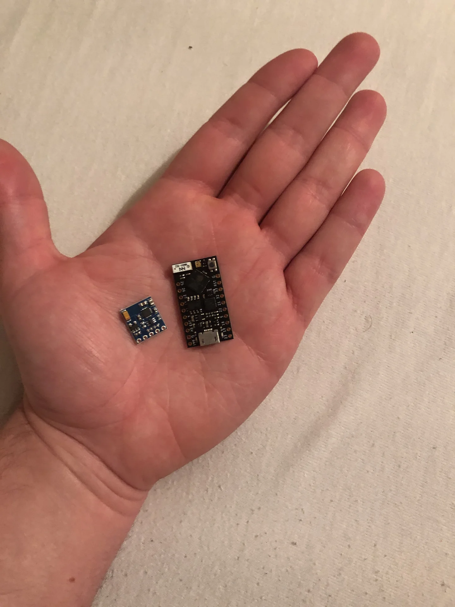
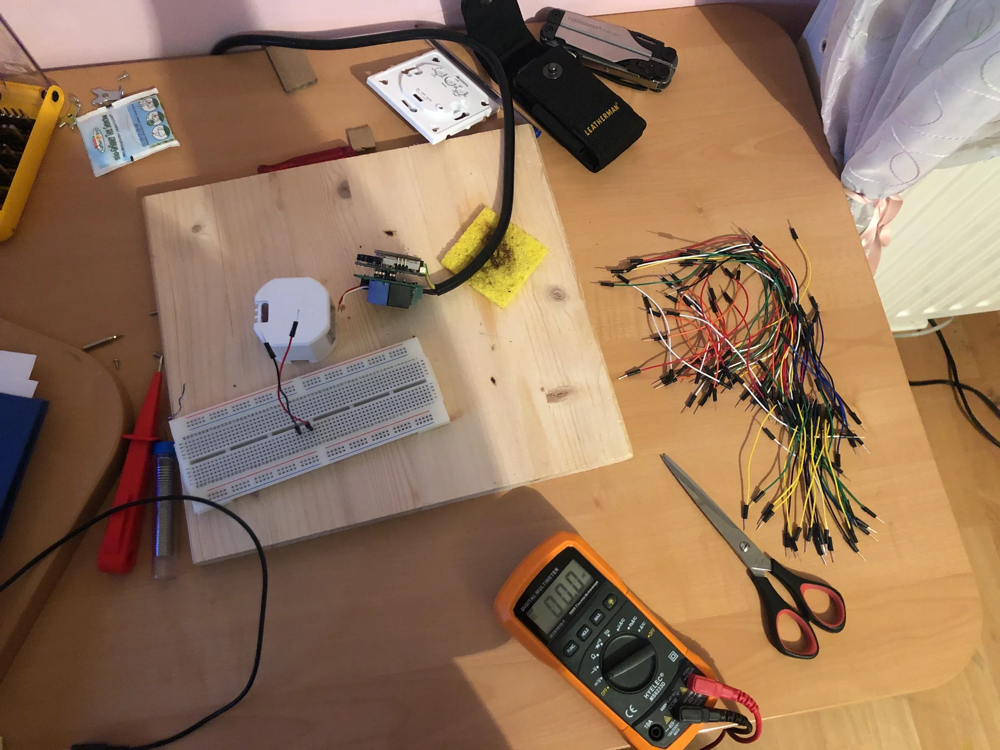
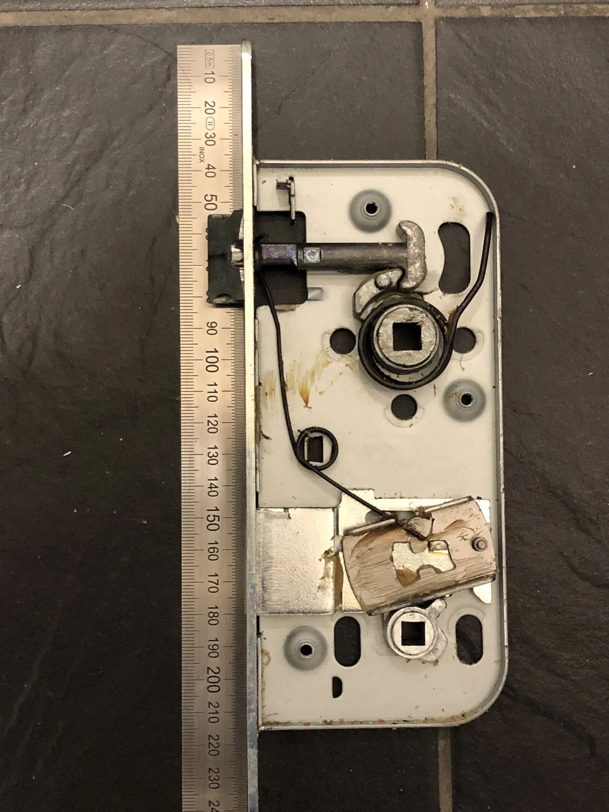
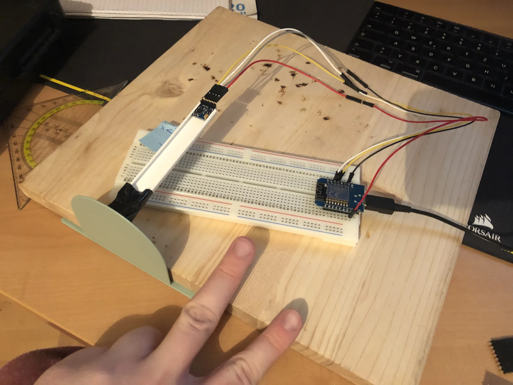
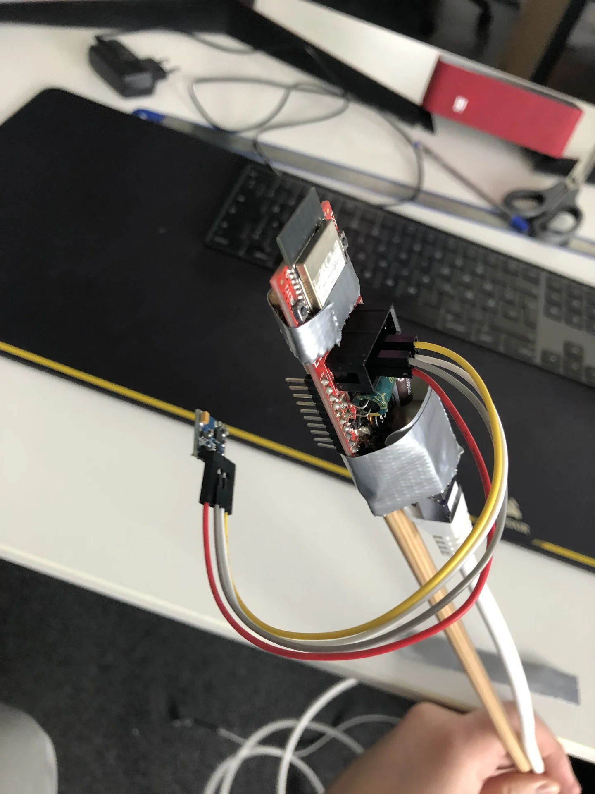
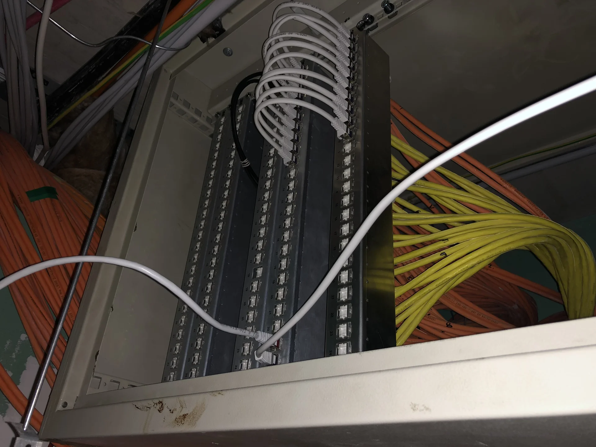
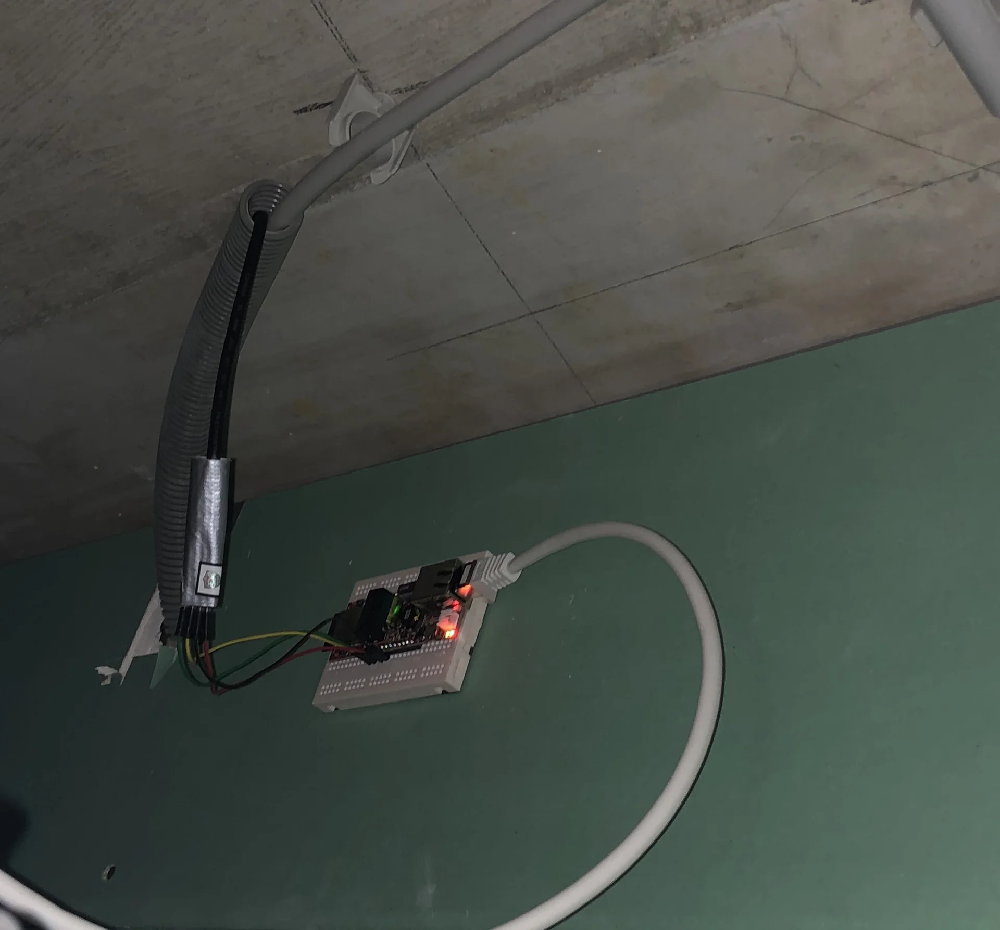

+++
title = "Heislberg: The Internet of Toilets"
summary = "How I used an ESP, Magnets and Kubernetes and to solve the great toilet crisis of 2021. A tale of absolutely necessary workplace optimization."
author = "Emanuel Mairoll"
date = "2024-11-15"
tags = ['IoT', 'ESPHome', 'MQTT', 'Office Automation', 'Toilets', 'Questionable Life Choices']
showTableOfContents = true
series = ["The Open Source Smart Home"]
series_order = 4
+++

Oh boy, do I love stupid projects. And oh boy, do I love IoT. But most of all, I love solving minuscule problems in absolutely ridiculous ways. 

So, this is the story of how I used an ESP, Magnets and Kubernetes to solve the great toilet crisis of 2021.

> I would have written this article far sooner, as it was my first contact with the IoT stack that I kept using for other (and more useful) home automation projects. However, some colleagues kept muttering about "privacy concerns" and "professional boundaries."
<br> But now that enough time has passed, I hope I can finally freely share this tale of absolutely necessary workplace optimization.

__*Stories from the Open Source Smart Home (Office) - Part 4*__

---

## The Great Toilet Crisis of 2021

Picture this: A thriving tech company. Twenty-something male engineers. One toilet stall.

You can see where this is going.

The daily dance was predictable: You'd feel nature's call, walk to the bathroom with confidence, only to find the stall occupied. Then came the walk of shame back to your desk, where you'd sit and wonder, "Is it free yet? Should I check again? How long is too long to wait?"

The real problem wasn't the single stall. It was the *uncertainty*. You'd walk all the way to the bathroom (a whole 20 meters!), find it occupied, and then have to walk ALL THE WAY BACK to your desk. That's 40 meters of completely unnecessary locomotion. Multiply that by 20 engineers, several times a day, and we're talking about kilometers of wasted movement.

We were engineers. We had Git workflows more sophisticated than NASA's launch protocols. We had CI/CD pipelines that would make DevOps consultants weep tears of joy. But we couldn't figure out if the toilet was free without physically walking there.

Obviously, this was unacceptable.


## Standing on the Shoulders of Giants (Who Got Told Off)

I wasn't the first to recognize this engineering emergency. Some brave colleagues had already installed a prototype back in the old office - a suspiciously large box mounted on the toilet stall that screamed "SURVEILLANCE DEVICE" to anyone within a 10-meter radius.

It worked perfectly - for exactly three days, before the CEO asked them to take it down. Something about "professionalism" and "what will investors think." 

> Sad engineering noises.

But as the team grew and the toilet traffic increased, the problem became impossible to ignore. 

And I had spare evenings.

## The Failed Experiments Hall of Fame

### Attempt #1: The Movement Sensor Hijack

The toilet had an existing PIR sensor that controlled the lights. "Perfect," I thought, "I'll just tap into that."


I ordered the exact same model from Amazon, cracked it open, and found just enough space for a TinyPICO, one of the smallest ESP32 boards available at the time. The plan was elegant: intercept the sensor signal, broadcast it, nobody would know.




Then I noticed the sensor ran on mains voltage. 230V AC. In a box of about 5 cm size. A sane person would have thought: "Hmm, shoving additional electronics into a mains-powered device that sits in a bathroom is probably a terrible idea. The risk of causing a short circuit that burns down the office or even kills someone is too high."

But I'm not a sane person. I'm an engineer with a mission.



So naturally, I had the sensor open, ready to reverse engineer. Connected to mains power of course, to be able to map out the voltages. Set up my workbench, got my multimeter ready, carefully mapped out the circuit. I was being *so* professional about it. Right up until the moment I accidentally touched the wrong part with my screwdriver.

*230V AC straight into my hand.*

The muscles in my arm did that fun involuntary contraction thing. The screwdriver went flying. The GFCI triggered. Several German words were invented.

> Ouch.

Ok ok... Lession learned... Moving on.


### Attempt #2: The Obvious Box 2.0

I considered recreating my colleagues' box design but making it smaller and less conspicuous.

After trying every possible mounting position, I however concluded that any external box would still look like we were filming a very specific genre of content.

Back to the drawing board.

### Attempt #3: Door Surgery

Maybe I could hide something in the door frame itself? 

I spent an entire evening with my toolbox spread across the bathroom floor. First, I removed the entire lock mechanism from the door. Then I disassembled it completely, every single spring and pin laid out on paper towels like I was performing mechanical surgery.

**The good news:** I found space inside the door frame cavity. <br>
**The bad news:** There was no way to get power there without visible cables. <br>
**The worse news:** I had to reassemble a door lock with mysterious leftover screws.




## The Breakthrough: Magnetic Fields Don't Lie

Remember playing with magnets and compasses as a kid? Magnet goes near compass, needle moves - basic physics that every 8-year-old knows. Take that same setup, and wiggle a piece of iron between them - the needle reacts. The magnetic field lines are "pulled into" the magnetic conductor, which changes the field the compass sees. Nothing fancy.

But here's what blew my mind: If you wiggle the iron *behind* the magnet - so on the opposite side, and quite a bit away from the compass - the needle STILL reacts. The metal behind the magnet changes the field in front of it.

So, while playing with Hall effect sensors for an unrelated project (I swear), I had an epiphany. The door lock was metal. And magnetic fields... they go through walls.

I could detect the door state from *inside the wall*.



### The Proof of Concept

I needed to test this theory. 

The wall in question was drywall - specifically, dual drywall that I could access through the hole for the movement sensor (that I'd previously electrocuted myself with). I grabbed a Wemos D1 mini I had lying around, connected it to a hall sensor, and attached the whole mess to the end of a ridiculously long USB cable.

While I dont have a picture of the actual sensor, here is a later revision of what I call a "Sensor on a Stick":



Then came the funny part: feeding this contraption through the wall cavity. I'd deliberately stayed late at the office for this experiment, figuring I'd have privacy for my bathroom floor engineering session.

Of course, that's exactly when a colleague returned to grab his forgotten laptop and found me sitting on the bathroom floor with a USB cable disappearing into the wall.

> Should I... ask? <br>
> Probably not. <br>
> Cool. See you tomorrow.

He left. We never spoke of it again.

Anyways, the sensor ended up roughly where I estimated the strike plate of the door lock would be. 

*Compass in place. ✅*

Next, I placed a neodymium magnet in the strike plate hole, which I could clearly see on the sensor readings behind it in the wall. 

*Magnet in place. ✅*

Then, locked the door in front of me, and... 

It worked. Not just "kind of worked" - it worked *perfectly*. 

The solid metal door lock was a perfect magnetic field conductor. With the magnet positioned just right, I could detect not just whether the door was closed, but even if it was *locked*. The bolt sliding into place created a completely different magnetic signature - the magnetometer XYZ values changed predictably: door open, door closed, door locked. Three distinct states, all readable from inside the wall.
 
It was beautiful. It was elegant. It was completely invisible.

It needed a name.

## The Heislberg Uncertainty Principle

If you were wondering about the posts title...

Werner Heisenberg was a German physicist. That means, he definitely had *something* to do with magnets. Probably. 

I mean, he defenitely did something with uncertanty (of toilet occupancy I guess). 

Plus, "Heisl" is Austro-Bavarian slang for a small house... or a toilet. 

*The joke practically wrote itself.*

Anyways, now that the most difficult part of every tech project is done - *naming it* - I could finally focus on the permanent installation.

### The Hardware

Around this time, my colleague was building his house and kept talking about his DIY home automation setup. He'd discovered these OLIMEX ESP32-POE boards which he used all over the system, and he couldn't stop praising them.

I was intrigued and asked if he could bring me a spare to try out. He did, I plugged it in, and immediately fell in love. The ESP ecosystem has amazing software support in general, the "32" in it meant enough processing power for anything I could throw at it, and Power over Ethernet meant no suspicious power cables running through the wall.

Basically: Perfect for toilet monitoring. (Also perfect for my sofa project, but that's yet [another story](/posts/iot1-sofa).)

For the Hall sensor, I went with the GY-271 HMC5883L - a 3D magnetometer breakout board that was easy to source and had good ESP library support. The only thing to watch out for was I2C's cable length - anything over 1-2 meters and the signal starts getting flaky.

### The Installation

This is where things got interesting. The movement sensor I'd unsuccessfully tried to hack earlier? It has to get power from *somewhere*. The next evening, armed with my cable pull rod, I went spelunking in the office infrastructure.

Following the cable with my pull rod through the wall cavity and cable conduit led me up into the dropped ceiling. Popping my head up there with a ladder revealed several incredible discoveries:

* My cable pull rod's other end
* An alarming amount of cobwebs
* A patch panel that went directly to our server room (jackpot!)



I'm not saying the building was designed for toilet monitoring, but I'm not *not* saying it either.

The installation process that followed was surprisingly straightforward:

First, I pulled a four-conductor telephone cable with pre-soldered terminal connectors (VCC, GND, SCA, SDL) through the existing conduit.

Next came the delicate operation of shoving the Hall sensor into the wall cavity, positioning it right behind where I'd placed a small neodymium magnet in the strike plate hole. The sensor dangled there on its wires like a very expensive spider.

The ESP32-POE got the royal treatment - plugged into a breadboard that I then mounted to the ceiling infrastructure using the finest installation method known to engineering: double-sided tape.



After connecting the I2C cable from the wall sensor to the ceiling-mounted ESP, I ran an Ethernet cable over to the patch panel. From there, it was a simple hop to the server room where I connected everything to a PoE injector on the guest network (the Network Admin had already given his blessing - he was surprisingly enthusiastic about the whole thing).

Total time: three hours, mostly spent wondering what I was doing with my life.

## The Toilet (Data) Pipeline

### The "Edge Device"

The ESP32-POE went through two iterations of firmware. Initially, I wrote it in C++ using libraries for the HMC5883L and MQTT - a simple polling loop that read sensor values and pushed them to the broker. It worked well for the first few weeks, but sometimes the sensor mysteriously got "stuck" without explanation. With no logs to debug with (because who needs logging?), we suspected a memory leak in one of the libraries. The only fix was a restart, which was particularly annoying when you're trying to maintain toilet monitoring uptime.

After successfully using ESPHome in other projects, I decided to migrate the Heislberg firmware as well. Not only was YAML configuration less likely to segfault the toilet, but it also provided proper logging and an elegant OTA update mechanism. As a bonus, said update mechanism also enabled us easily performing the occupancy classification directly on the ESP rather than relying on the rest of the pipeline.

Here's the final ESPHome configuration (which, admittedly, still became much more C++ heavy than anticipated):

```yaml
esphome:
  name: heislberg-wcm
esp32:
  board: esp32-poe
  framework:
    type: arduino
logger:
ota:
  password: <OTAPASSWORD>

ethernet:
  type: LAN8720
  mdc_pin: GPIO23
  mdio_pin: GPIO18
  clk_mode: GPIO17_OUT
  phy_addr: 0
  power_pin: GPIO12

mqtt:
  broker: <MQTTSERVER>

binary_sensor:
- platform: gpio
  pin:
    number: GPIO34
    inverted: true
  id: button_onboard

############################ MAGNET SENSOR ############################

i2c:
  sda: GPIO13
  scl: GPIO16
  scan: false

sensor:
  - platform: hmc5883l
    id: door_sensor
    field_strength_x:
      name: "Field Strength X"
      filters:
        - delta: 1.5
      on_raw_value:
        then: 
          - lambda: 'id(current_x) = x;'
    field_strength_y:
      name: "Field Strength Y"
      filters:
        - delta: 3.0
      on_raw_value:
        then: 
          - lambda: 'id(current_y) = x;'
    field_strength_z:
      name: "Field Strength Z"
      filters:
        - delta: 1.0
      on_raw_value:
        then: 
          - lambda: 'id(current_z) = x;'
          - script.execute: update_door_state
    oversampling: 4x
    range: 130uT
    update_interval: 0.2s

############################ SENSOR POSTPROCESSING ############################

text_sensor:
  - platform: template
    id: door_state
    name: "Door State"
    filters:
      lambda: |-
        if (x == id(door_state).state) {
          return {};
        } else {
          return x;
        }

globals:
  - id: current_x
    type: float
    restore_value: no
    initial_value: '0'
  - id: current_y
    type: float
    restore_value: no
    initial_value: '0'
  - id: current_z
    type: float
    restore_value: no
    initial_value: '0'

script:
  - id: update_door_state
    then: 
      - lambda: !lambda |-
          // static declarations
          struct xyz {
            std::string name;

            float x;
            float y;
            float z;

            xyz(std::string cname, float cx, float cy, float cz) {
              name = cname;
              x = cx;
              y = cy;
              z = cz;
            }
          };

          xyz positions[] = {
            xyz("open", -45.2, -96.0, 0.1),
            xyz("closed", -47.3, -101.6, 0.1),
            xyz("locked", -52.0, -125.6, 0.1)
          };

          // actual updating code
          xyz current("current", id(current_x), id(current_y), id(current_z));
          
          float smallest_distance = std::numeric_limits<float>::max();
          xyz nearest = xyz("none", 0, 0, 0);

          for (xyz position: positions) {
            float dx = current.x - position.x;
            float dy = current.y - position.y;
            float dz = current.z - position.z;
            float distance = std::sqrt(dx * dx + dy * dy + dz * dz);

            if (distance < smallest_distance) {
              smallest_distance = distance;
              nearest = position;
            }
          }

          id(door_state).publish_state(nearest.name);
```

### MQTT server

Nothing fancy here - just a standard Mosquitto server running in our Kubernetes cluster, deployed specifically for this project (because of course we spun up dedicated infrastructure for toilet monitoring). 

The broker was exposed on the guest network (same network as the ESP32), which made the Network Admin happy since it kept the toilet traffic segregated from production systems. Running it in Kubernetes was probably overkill for a broker handling just a handful of topics (magnetic field XYZ values, door state, and the occasional diagnostic message), but hey - if you're going to over-engineer a toilet sensor, you might as well give it enterprise-grade message queuing. Plus, automatic restarts meant we'd never lose toilet telemetry due to a crashed broker. Priorities.

### Janus: Data Processing

Before migrating to ESPHome and its convenient OTA updates, we wanted to decouple the sensor data from the classification logic (because that's what you do when you're definitely not over-engineering). The idea was to avoid having to reflash the firmware if the magnetic field values ever changed - which would require more ceiling spelunking to physically access the ESP32.

Enter Janus, a small Go microservice that acts as the central hub for all toilet data:

- Subscribes to raw XYZ magnetic field values
- Classifies these positions in 3D space (open/closed/locked) using thresholds
- Exposes toilet status via HTTP endpoints
- Reports metrics to Datadog (because we needed toilet analytics, apparently)
- Runs in Kubernetes for high availability (obviously)

The name? Janus is the Roman god of doors and transitions. Also, it sounds like... well, you get it. We're professionals here.

As described above, we later dropped the classification part and moved it to the edge device, but Janus remained the central hub for data format conversions and API endpoints. Never waste a good pun-based microservice name!

## The Many Visualizations (The Part Where We Kinda Lost Control)

### Company Dashboard

We added the toilet metrics to our main Datadog dashboard, right between API response times and Kubernetes pod health. The Datadog gauge was a bit slow to react though, so we hacked together a small dashboard embed fed by Janus for real-time updates. A highlight at every weekly tech sync.

### Menu Bar Apps

I also wrote a small Swift app for macOS that lived in the menu bar. A tiny toilet icon with either a red or green dot. It could even send notifications when the toilet became free!


The app used CocoaMQTT to subscribe to the `heislberg/door_state` topic and mapped each state to an emoji. The fun part: You could configure it to run shell commands on state changes, so you could theoretically hook it up to anything - notifications, scripts, whatever automation your heart desired.

If you by chance ever happen to need a macOS menu bar app that shows toilet occupancy, feel free to use it:



### Random ESPs
I had a few spare Wemos D1 mini boards lying around, so I flashed them with a simple ESPHome config that showed the toilet status on the small onboard LED - off for free, on for occupied. Dangling on their small USB cables, they found homes in various places around the office - under desks, on shelves, wherever someone might glance at them and get a quick status update.

### The ON AIR Sign

Lastly, I had grand plans for a huge "ON AIR" sign that would light up when occupied. You know, the classic red broadcasting light that every podcast studio has - except ours would indicate a very different kind of live performance.

I'd already sourced everything: a vintage-style LED sign from Amazon, an ESP8266 based relay module to control it from AliExpress, and I'd even started writing the ESPHome config for it.

The vision was clear - a big, unapologetic beacon of toilet occupancy that would finally bring our bathroom monitoring system out of the shadows (or walls, in this case). 

Subtle? No. Effective? Absolutely.

Sadly, I left the company before installation day arrived. But, somewhere in my basement, buried in a box of electronics parts, that sign still waits for its moment of glory.

## The Legacy

Before I left, the system had been running flawlessly for months. It processed over 15,000 "transactions." The average occupancy was 6.3 minutes. Peak usage was Wednesday at 03:30 PM (after the all-hands meeting with a lot of coffee).


The beautiful thing is that the system might still be running. Hidden in the walls, an ESP32 silently monitoring magnetic fields, broadcasting to an MQTT topic that maybe nobody subscribes to anymore. A digital ghost of over-engineering past.

---

*This is Part 4 of my "Unnecessary Home Office Automation" series. All names have been changed to protect the guilty. No toilets were harmed in the making of this project. The CEO eventually found out, and found it pretty funny after all. Privacy concerns were... addressed retroactively.*
