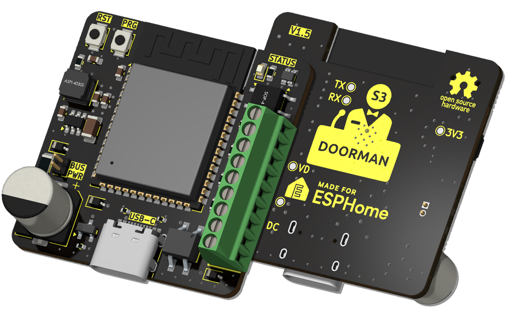
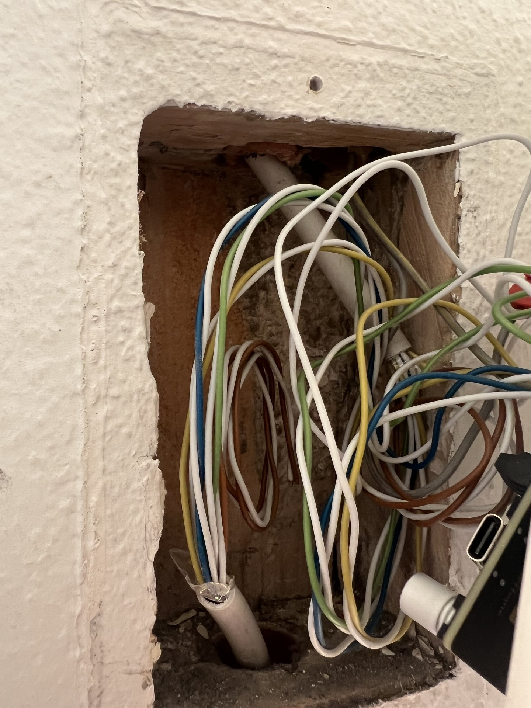

+++
title = "IoT Mini Stories"
summary = "A collection of smaller home automation projects built on open source solutions from others. From magically opening entrance doors to RGB ambience behind every piece of furniture, and a standing desk that obeys Siri."
author = "Emanuel Mairoll"
date = "2026-01-04"
tags = ['IoT', 'Home Assistant', 'ESPHome', 'WLED', 'Shelly']
showTableOfContents = true
series = ["The Open Source Smart Home"]
series_order = 5
+++


Or: Standing on the shoulders of open source giants


Over the years, I've accumulated various home automation projects that are individually too small to justify a full blog post. Unlike the reverse-engineering in my other posts, these are more about discovering, configuring, and integrating open source solutions from others. So here they are, combined into this mini story collection.

__*Stories from the Open Source Smart Home - Part 5*__

---

## The Doorman: Never Fumble for Keys Again

Let's start with my most recent addition. Here in Zurich, my apartment building has a Koch TC bus intercom system. Most importantly, there's a handset in my apartment with a button to buzz someone in downstairs.

*The intercom handset - featuring the magical "open door" button*

The daily struggle was real: Arriving home with groceries in both hands, standing at the entrance, trying to fish out keys while bags slowly cut off circulation to my fingers. There had to be a better way.

Fortunately, someone already figured this out. I discovered that [AzonFlo](https://github.com/AzonInc/Doorman) has reverse-engineered the Koch/TCS protocol and sells a neat little PCB called the **Doorman S3**. It's ESP32-S3 based and connects directly to the two-wire bus, exposing various functions to Home Assistant - most importantly, a "door open" action that simulates pressing the entrance release button.

*The Doorman S3 - a tiny ESP32-S3 based gateway for your intercom*

### The Setup

The device comes pre-flashed with ESPHome, so installation was surprisingly straightforward. You can find the correct wiring schematics in the [documentation](https://doorman.azon.ai/guide/getting-started). I was slightly worried I'd bring down the whole system or accidentally ring all doorbells in the apartment building, but everything went smoothly.

*The wiring situation (aesthetics optional) - the Doorman dangles on the lower right*

*The Doorman installed and blinking behind the intercom mounting plate*

Now, every time I approach my building with arms full of groceries, one tap gesture on my phone and the door opens automatically. Well, to the confusion of my neighbors, who probably think I'm practicing street magic.

I had a few questions during installation and reached out via the [Doorman Discord](https://discord.gg/t2d34dvmBf). Flo was super helpful and responsive. The device costs around €30, which is very reasonable for a custom-built, pre-flashed PCB. Consider supporting the project if you have a compatible intercom system!

**Doorman S3:** ~€30 assembled and pre-flashed  
**Where to buy:** [doorman.azon.ai](https://doorman.azon.ai) or contact via Discord

---

## WLED: RGB Ambience Everywhere

Next up, something I've been using for quite a while now to bring some ambience into my apartment: **WLED**.

WLED is open-source control software for individually addressable RGB LED strips. It integrates with basically everything - Home Assistant, Apple HomeKit (via Homebridge), voice assistants, you name it. You can set colors, create scenes, run light effects, react to sound, sync multiple devices together... the feature list is endless.

The UI could honestly be a little cleaner, but for open-source software maintained by volunteers, I'm not complaining. It works, and it works well.

*WLED-powered LED strips bringing ambience to my desk setup*

*The WLED web interface - functional, with a lot of features*

### The Hardware Choice

For the LED strips, I opted for **WS2815** because they run on 12V instead of the typical 5V. Higher voltage means less voltage drop over distance, which allows for longer cable runs without the end of the strip turning into a sad brownish-orange.

I've placed them *literally everywhere*:
- Behind the extensible sofa
- Behind the TV lowboard
- In the kitchen
- Behind my desk
- Behind my bed (for, you know, *ambience*)

**WS2815 LED Strip:** ~€25-30 for 5m (60 LEDs/m) on AliExpress

### The Control Board

For the control boards, I wanted something that works out of the box - a finished PCB rather than a breadboard disaster waiting to happen. After browsing the WLED-supported device list, I found [MyHome-Control](https://shop.myhome-control.de) by Dr.-Ing. Wladislaw Waag.

These controller boards are convenient:
- Support different voltages (5V, 12V, 24V)
- Have an inbuilt fuse
- Include proper level shifters
- Feature a socket for an ESP8266 module

*The [ABC! WLED Basis-Board](https://shop.myhome-control.de/ABC-WLED-Basis-Board-active/SW11201) - gotta love that rainbow font*

They work well for the most part, but occasionally I experience some quirks - random device resets, lost WiFi connections, that sort of thing. I suspect the ESP8266 is showing its age. Eventually, I'll probably replace it with an ESP32, or upgrade to something like the [QuinLED-Dig-Octa](https://quinled.info/quinled-dig-octa/) which has built-in Ethernet for additional stability.

**ABC! WLED Basis-Board:** ~€25 at [shop.myhome-control.de](https://shop.myhome-control.de/)  
**QuinLED-Dig-Octa Brain- and Powerboard:** ~$70 at [quinled.info](https://quinled.info/quinled-dig-octa/)

Just as a sidenote: The few bugs with this lighting system are *nothing* compared to my experiences with my new **Nanoleaf setup**, which is hands-down the worst smart home ecosystem I ever had the misfortune of using. But that rant deserves its own blog post. Somewhere. Sometime. When I've calmed down.

---

## Upsy Desky: The Smart Standing Desk

Another thing I'm using is built into my electric standing desk - an **IKEA UPPSPEL**.

I love this desk. As a computer scientist, standing while working is a blessing for my back. Something something ergonomics, something something posture. You know the drill.

But if you've been reading this series, you know me by now: If there's something in my apartment with buttons, it *needs* to be connected to Home Assistant. Because reasons.

Enter the **Upsy Desky**, a small ESP32-based PCB I bought from [Tindie](https://www.tindie.com/stores/tjhorner/). Created by TJ Horner, it goes between the control panel and the motor driver, intercepting the communication and exposing it via the ESPHome API.

*The Upsy Desky - making standing desks smarter!*

By connecting it to Home Assistant, you get:
- Current height reading
- Preset position recall
- Set positions via automations
- Height-based triggers

Is this needed? Probably not.

Is it a funny gag when I say "Hey Siri, I want to stand" and my desk starts rising? *Absolutely*.

The Upsy Desky supports various standing desks with RJ45 keypad interfaces (Uplift, Jarvis, Omnidesk), including the IKEA UPPSPEL desk. Just plug it in and it works out of the box.

**Upsy Desky:** ~$50 on [Tindie](https://www.tindie.com/stores/tjhorner/) - a bit expensive, but cool  
**Documentation:** [upsy-desky.tjhorner.dev](https://upsy-desky.tjhorner.dev)

---

## Shelly: The Flash-Friendly Smart Switches

I've also been using quite a few **Shelly** devices. They sell various mains-connected smart switches that go behind your existing light switches, bringing both the switch and the lights into Home Assistant.

They're cheap. They work. What more could you ask for?

I've used different models:
- **Shelly 2.5** for automating the lights in my old apartment
- **Shelly Uni** for my [roof window project](/posts/iot2-window)
- **Shelly Plus Plug S** for my [door project](/posts/iot3-door)

Sadly, the Shelly 2.5 has since been discontinued, but the [Shelly 2PM Gen4](https://www.shelly.com/products/shelly-2pm-gen4) is a fitting replacement.

*The Shelly 2.5 - small enough to fit behind most light switches*

But here's what makes Shelly devices special for tinkerers: They're *incredibly* flash-friendly.

Unlike most smart home devices that lock you into vendor clouds and proprietary apps, Shelly:
- Uses ESP-based chips
- Exposes the programming headers
- Provides documentation on how to flash custom firmware
- Doesn't even void your warranty for flashing

So what you *can* do with Shellys is flash your own ESPHome config, and the device becomes 100% yours. No Chinese vendor clouds for my light bulbs. No phoning home. No wondering what telemetry is being collected.

Just local control. As it should be.

**Shelly 2PM Gen4:** ~€30  
**Where to buy:** [shelly.com](https://www.shelly.com/products/shelly-2pm-gen4) or various retailers

---

## Home Assistant: The Glue That Binds

And lastly, the thing that connects all of these very necessary home automation parts: **Home Assistant**.

My setup runs on a small Raspberry Pi 4 with a few key plugins:
- **Homebridge** plugin to expose everything to Apple HomeKit
- **ESPHome** add-on for flashing and monitoring ESP devices
- **iSponsorBlock** plugin for YouTube TV (absolute blessing)

This way, I get the flexibility of Home Assistant's powerful automations while still being able to say "Hey Siri, turn off all the lights" and have it actually work.

*My Home Assistant dashboard - command center for unnecessary automation*

I'll probably eventually upgrade to **Home Assistant Green** - a dedicated device that comes with Home Assistant pre-installed. It's fanless, silent, has 32GB storage and 4GB RAM, and just works out of the box.

But for now, the Pi 4 serves me well. If it ain't broke, don't fix it. (Unless you're me, in which case: if it ain't connected to Home Assistant, it needs to be fixed.)

**Home Assistant Green:** ~$129 / €109  
**Where to buy:** [home-assistant.io/green](https://www.home-assistant.io/green) or various retailers like CloudFree, AmeriDroid

---

## The Takeaway

Is any of this really necessary? Of course not. But that's not the point.

As a kid, I used to draw invented circuits in my notebook - imaginary systems to control parts of my parents' home. Back then, it was pure fantasy.

Now I actually get to build these things. Making a computer control the physical world never stops being cool, and every project is another excuse to learn something new.

---

*This is Part 5 of my "Stories from the Open Source Smart Home" series. No cloud services were used in the smartification of this apartment. The RGB LEDs behind the bed have been used exactly as often as you'd expect.*
