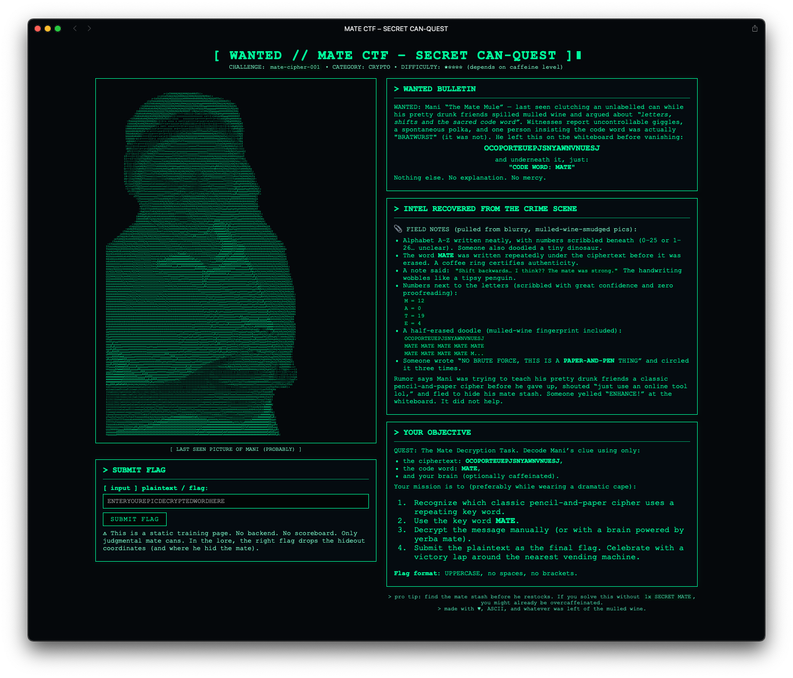
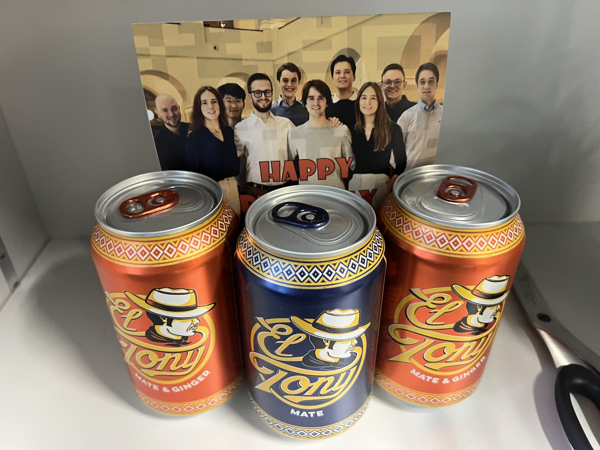

+++
title = "Mate CTF: The Greatest Birthday Present Ever Made"
summary = "My friends built me a custom CTF for my 26th birthday. It had QR codes hidden in birthday cards, physical flags at ETH, and an ESP32 \"rowhammer\" challenge. A tale of caffeine addiction and hardware security trauma."
author = "Emanuel Mairoll"
date = "2025-12-28"
tags = ['CTF', 'Birthday', 'Hardware Security', 'ESP32', 'Rowhammer', 'Mate', 'Friendship']
showTableOfContents = true
+++

After a semester that can only be described as "Hardware Security: A Trauma Simulator," I was very much looking forward to Christmas break. Professor Razavi had successfully brought me to my knees with side-channel attacks, speculative execution, and enough DRAM exploitation theory to give anyone nightmares about their DIMMs.

But before Christmas comes my birthday - roughly a week before, in that sweet spot where everyone is already in party mode but not yet back home for the holidays. And this year, being the lucky resident of a spacious JUWO apartment, I decided to go big. Over twenty friends invited. Mate and mulled wine flowing freely. Mario Kart tournament running on the other end of the room. 

One might think the highlight of such a party would be seeing all these wonderful people together. The drinks. The conversations. The inevitable Rainbow Road rage-quits.

But actually? The absolute highlight was one of the presents.

---

## The Birthday Card That Wasn't Just a Birthday Card

My friends from the [KÖS](https://www.koes.ch) (Club of Austrian Students in Zürich) handed me a birthday card. Handmade, which was already touching. I read through the congratulations, smiling at the inside jokes and well-wishes, when I noticed something... off.

There was a weird pattern on the front of the image.

I squinted. Tilted the card.

"Look at it more closely," one of them suggested, barely containing a grin.

And then it clicked.

**It's a QR code.**

I shouted it out loud: "Guys, you made a FUCKING CTF out of this, didn't you?!"

The grins around me confirmed everything. I was already blown away, and I hadn't even started solving it.


### The Hidden QR Codes

The card had not one, but two QR codes hidden in it.

The first was color-matched into the front image - subtle but visible once you knew to look. After some image processing I decoded it: **"Osterei"** - either the German word for "Easter Egg" or a nudge to my *distinctive* hairstyle. (I'm bald. The reader may decide which interpretation is correct.) A dead end, but a funny one.

On the back: a 21x21 grid of ones and zeros. At first I tried the obvious - threw it into CyberChef, ran Magic, nothing useful came out. But then I realized that 21x21 is exactly the size of a Version 1 QR code. I transcribed the binary grid (thank you, Claude) and scanned it.

And that's when I completely lost it.

## Welcome to Mate CTF

The QR code led to [ctf.koes.ch](https://ctf.koes.ch) - a fully custom CTF website my friends had created *just for me*.



The homepage was styled like a terminal, complete with a "WANTED" bulletin of "Mani - The Mate Mule" and an ASCII art render of me holding a mate can. The title: **MATE CTF - SECRET CAN-QUEST**.

> "Mani" is my nickname in the friends group, for those wondering. "Mate Mule" is... also accurate.

This was already the best present I'd ever received. But it was only the beginning.

---

## Challenge 1: The Vigenère Cipher

> Difficulty: ★☆☆☆☆ (depends on caffeine level)

The first challenge presented a ciphertext:

```
OCOPORTEUEPJSNYAWNVNUESJ
```

And a hint: **CODE WORD: MATE**

The field notes included observations from the "crime scene":

> *"Someone wrote 'NO BRUTE FORCE, THIS IS A PAPER-AND-PEN THING' and circled it three times."*

Classic Vigenère. I threw it into an online decoder with the key "MATE" and out came the flag:

**ACHTARMIGEINENREINORGELN**

For non-German speakers: this is an insider reference to [a legendary voice message](https://youtu.be/nlLQgHO3V3M) from a man who had a very... interesting... morning after looking a bit too deep into the glass. If you speak German, I highly recommend.

---

## Challenge 2: Physical Fieldwork

> Difficulty: ★★★☆☆ (depends on how fast you can walk to CAB)

The next challenge informed me that I needed to retrieve a physical flag. From ETH Zürich. From a specific office in CAB.

> *"Local rumor: the room may be guarded by a desk knight who does not appreciate mate cans on his table. There's also a second knight—friendly, curious, possibly bribable with stickers—who you'll need to ask for help to recover the mate."*

The next morning, still slightly recovering from the party, I made my way to ETH. The office belonged to my coworker - the legendary "desk knight" as he was dubbed in the challenge. I may have left stuff on his desk one too many times. Oops. Sorry about that.



I found what I was looking for in the mate stash. A mate can with a flag written on it:


**1-Ei-4-Zigaretten-1-Ibuprofen-1-Rosinenbroetchen-mit-Leberwurst**

*(Another reference to that legendary voice message - the man's hangover breakfast. It's a whole thing.)*

And then the references to Hardware Security started.

---

## Challenge 3: The Rowhammer Finale

> Difficulty: ★★★★★ (depends on stress levels)

The website spun up a whole narrative. The villain "Professor Kaveh" had stolen a Letter of Inner Peace and locked it behind "layers of hardware paranoia." There was an ESP32 hidden somewhere in that office. I needed to find it and... execute a rowhammer attack on it.

*Of course.*

After the semester I'd just survived, my friends decided the perfect birthday present was *more hardware security exploitation.*

I love them. I hate them. It's complicated.

### Finding the ESP

The ESP32 was hidden in the same office, below a bunch of PCBs on a shelf, connected to nothing, waiting for me to give it power.

When I plugged it in, it created a WiFi network:

```
Network: CTF
Password: rowhammer
```

> *"Classic Kaveh: he literally made the WiFi password 'rowhammer' because he spent half a semester lecturing about DRAM bit flipping attacks."*

### The Challenge Interface

Connecting to `192.168.4.1` revealed a beautifully crafted challenge page. The premise: a vulnerable memory region on the ESP32 (Xtensa LX6 architecture), and I needed to flip a single bit to bypass a security check.

Of course, this wasn't *actual* rowhammer - nobody (publicly) knows how to rowhammer an ESP32, and usefulness would be limited without an OS anyway. But the challenge simulated the concept: find the right address and bit to flip, and the authentication check would pass.

### Reverse Engineering the Binary

I dumped the memory region and loaded it into IDA. The disassembly revealed a function with only one branching instruction:

```asm
...
ROM4008299A                 mov.n   a11, a5
ROM4008299C                 mov.n   a10, a6
ROM4008299E                 call8   0x4008CBBC
ROM400829A1                 l32i.n  a8, fp, 4
ROM400829A3                 beqz.n  a2, loc_400829D0
ROM400829A5                 movi.n  a6, 3
ROM400829A7                 l32r    a8, 0x40080700
ROM400829AA                 l32i.n  a5, a8, 0
ROM400829AC                 call8   0x4008CCA4
...
```

A `beqz.n` (branch if equal to zero) instruction. On Xtensa, `beqz` and `bnez` differ by just one bit - perfect bit-flip target. Flip that bit and the branch logic inverts.

### The Flip

After consulting the Xtensa instruction set manual, I found the bit to flip:

```
Address: 0x400829A3
Bit: 6
```

Executed the attack.

**FLAG{r0wh4mm3r_b1t_fl1p_m4st3r_2025}**

---

## The Actual Present

Entering the final flag revealed the *actual* gift behind all this madness:

**A coupon for a day at the Hürlimann Spa in Zürich.**

After this semester of hardware security torture, my friends had created an elaborate multi-stage CTF culminating in... rest. Relaxation. Inner peace.

I honestly couldn't have asked for a better (or more fitting) present.

---

## Reflections

I've solved a lot of CTFs. I've competed in major competitions. I've exploited real vulnerabilities and written serious writeups about them.

But this? This was different.

My friends built something *just for me*. They incorporated inside jokes spanning years of friendship. They referenced my caffeine addiction, my *distinctive* hairstyle, and my trauma from a specific university course. They hid physical challenges across ETH and programmed an actual ESP32 to serve a hardware security puzzle.

Was the technical complexity insane? No - the Vigenère was easy, the bit-flip required some reverse engineering but nothing extreme, and the website was obviously vibecoded. But that wasn't the point.

The point was that my friends know me. They know what makes me tick. And they channeled that into something creative, funny, and deeply personal.

I'm lucky to have them.

---

## Party Impressions

Beyond the CTF, the party itself was a blast. 20+ friends buzzing around in my apartment, some of them gathering around the Mulled Wine Dispenser, some of them at Mario Kart tournament waiting for their turn of Rainbow Road rage. While we did a Mate tasting of different "ashtray flavours", two friends found my glass chess set, and 5 minutes later there was a game of speed chess going on. Discussions ranged from quantum computing to which mate brand has the best caffeine-to-taste ratio.

The mix of people never ceases to amaze me - Austrian troublemakers building birthday CTFs, Hackers from all over the world debating Mario Kart strategies, and everyone in between arguing about the optimal way to prepare mulled wine.



---

*Thanks to the Austrian crew for the most creative present I've ever received. You know who you are. The mate's on me next time.*

*And thanks to Professor Razavi for the trauma that made the final challenge hit so much harder. I think.*
